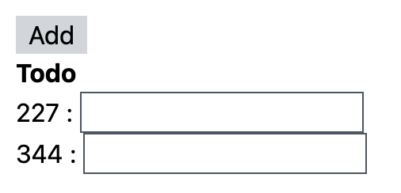
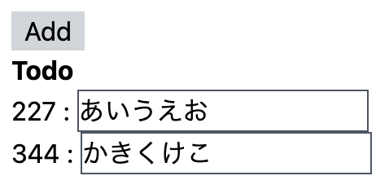
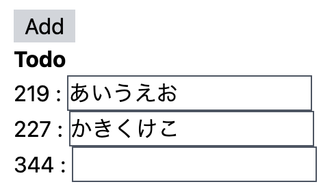
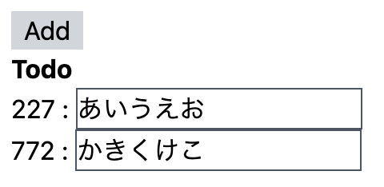
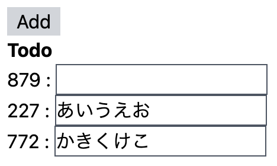

<!--  -->

<!-- omit in toc -->
# Appendix A
ここでは、補足情報を記載します。

<!-- omit in toc -->
## 目次
- [key propを正しく設定しなかった時に発生する問題](#key-propを正しく設定しなかった時に発生する問題)
- [Link: React目次ページ](#link-react目次ページ)


## key propを正しく設定しなかった時に発生する問題
ここでは、すでにviteで作成したprojectフォルダがあり、tailwindをインストールしていることを前提にコードを書いていきます。

`key` propに配列のindexを設定した場合に、レンダリングが不正確になってしまう例を紹介します。以下のコンポーネントを作成してください。

`src/components/ToDos.tsx`
```jsx
import { useState } from "react";

interface Todo {
  id: string;
  value: JSX.Element;
}

const ToDos: React.FC = () => {
  const [todos, setTodos] = useState<Todo[]>([]);
  // todoを先頭に追加する関数
  const handleAddTodo = () => {
    setTodos((prev) => [
      {
        id: Math.floor(Math.random() * 1e3)
          .toString()
          .padStart(3, "0"),
        value: <input className="border border-gray-600" />,
      },
      ...prev,
    ]);
  };
  return (
    <div>
      <div className="flex items-center space-x-2">
        {/* Todoの入力を先頭に追加するボタン */}
        <button
          className="bg-gray-300 px-2"
          onClick={() => {
            handleAddTodo();
          }}
        >
          Add
        </button>
      </div>
      {/* Todoの表示 */}
      <div className="font-bold">Todo</div>
      <ul>
        {todos.map((todo, index) => (
          // 本来NGな配列のindexをkey propに設定する
          <li key={index}>
            {todo.id} : {todo.value}
          </li>
        ))}
      </ul>
    </div>
  );
};

export default ToDos;
```

また、実行結果が確認できるように`App.tsx`を以下のように編集しましょう。

```jsx
import ToDos from "./components/ToDos";

function App() {
  return (
    <div className="m-4 space-y-2">
      <ToDos />
    </div>
  );
}

export default App;
```

それでは、`npm run dev`を実行し、ブラウザで結果を確認しましょう。

`ToDos`コンポーネントは、Addボタンを押すと、id（ランダムな3桁の数字）とinputが先頭に追加されます。以下は、Addボタンを2回押した時の例です。



それでは、ここのinputに何か入力をしてから、Addボタンを押してみましょう。



ここで、Addボタンを押すと…



Addボタンを押す前は、idが227に「あいうえお」、344に「かきくけこ」が入っていました。しかし、Addボタンを押すとidが219に「あいうえお」、227に「かきくけこ」が入っており、344は空になっています。

これは、`key` propに配列のindexを渡しているので、Reactでは、`key=1`の`value`が「あいうえお」、`key=2`の`value`が「かきくけこ」と認識されています。この状態で、Addボタンが押下されると配列の先頭に要素が追加され、Reactは`key`が同じところに`value`を設定するので、このようなズレが発生します。

`key` propを正しく設定した場合の挙動も見てみましょう。

`ToDos`コンポーネントのmapでリストを生成している部分を以下のように変更しましょう。

`src/components/ToDos.tsx`
```jsx
<ul>
  {todos.map((todo) => (
    // 本来NGな配列のindexをkey propに設定する
    <li key={todo.id}>
      {todo.id} : {todo.value}
    </li>
  ))}
</ul>
```

それでは、ブラウザで実行結果を確認しましょう。以下は、Addボタンを2回押下し、inputに文字を入力した後の画面です。



ここで、Addボタンを押すと…



idとvalueが正しく紐づいているので、意図した挙動になっていると思います。

**注意**
ここでは、簡単のためidはランダムな数字3桁にしていますが、本来はユニークなものにするべきです。DBから取得した値などは、すでにユニークなIDが付いているでしょうし、フロントでIDを付与しなければならない場合も、nanoidなどのライブラリを使用してユニークなIDを付けましょう。

## [Link: React目次ページ](../index.md)

<!--  -->