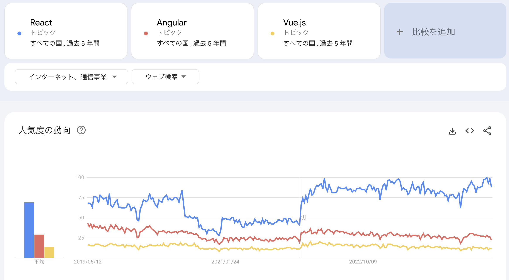
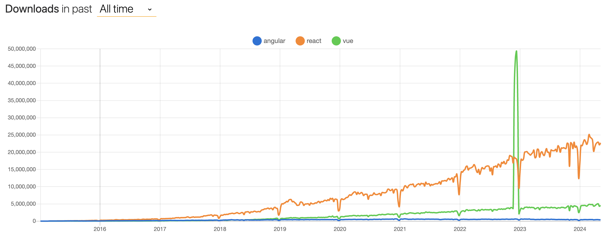
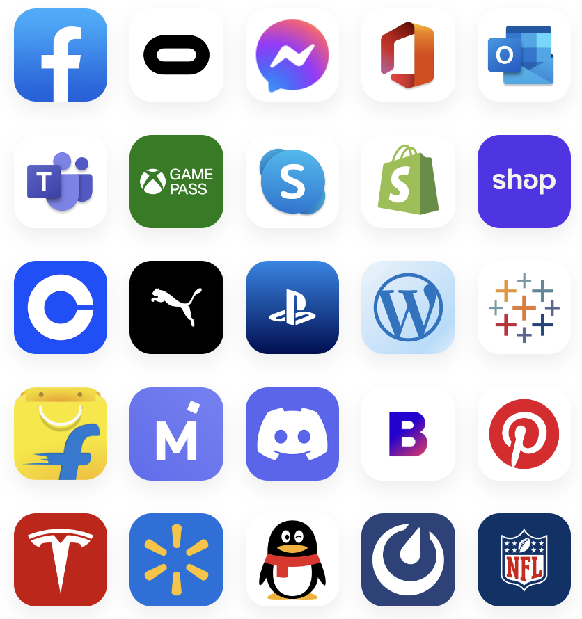

<!--  -->

<!-- omit in toc -->
# なぜReactを使うのか？
ここでは、なぜReactを使うのか？をReactの特徴を挙げながら、説明していきます。

<!-- omit in toc -->
## 目次
- [他のライブラリ・フレームワークとの比較](#他のライブラリフレームワークとの比較)
- [Reactの利点・特徴](#reactの利点特徴)
  - [高速なレンダリング](#高速なレンダリング)
  - [コンポーネント指向](#コンポーネント指向)
  - [Learn once, write anywhere](#learn-once-write-anywhere)
  - [個人的に感じた利点](#個人的に感じた利点)
- [まとめ](#まとめ)
- [Next: Chapter1 Reactの開発環境の準備](#next-chapter1-reactの開発環境の準備)


## 他のライブラリ・フレームワークとの比較
モダンなjavascriptライブラリ・フレームワークとして以下のようなものが挙げられます。
- React
- Angular
- Vue.js

[Google Trends](https://trends.google.co.jp/trends/explore?cat=13&date=today%205-y,today%205-y,today%205-y&geo=,,&q=%2Fm%2F012l1vxv,%2Fg%2F11c6w0ddw9,%2Fg%2F11c0vmgx5d#TIMESERIES)で上記3つのキーワードを見てみると、Reactが最も検索されているワードであることがわかります。(2024年5月現在)




また[npmトレンド](https://npmtrends.com/angular-vs-react-vs-vue)を見るとわかりますが、上で挙げたライブラリの中で一番インストールされていることがわかります。(2024年5月現在)




## Reactの利点・特徴
ここでは、Reactの利点・特徴について説明します。

### 高速なレンダリング
上で挙げたAngularやVue.jsも同じような特徴がありますが、Reactでは、仮想DOMを用いることで、DOMに変更があった箇所のみを更新します。

そのため、仮想DOMを用いずにDOM全体を再構築するjQueryなどよりも高速に更新（レンダリング）することができます。

### コンポーネント指向
Reactでは、画面の各構成要素を関数（コンポーネント）として定義していきます。これにより、画面の各構成要素のUIとそれに伴うロジックが１つのコンポーネントとして分離されます。

このことにより、以下のような特徴が得られます。

- 再利用性の向上
  
  構成要素がコンポーネントとして分離されるので、画面上で同じようなロジックを持つものは、同じコンポーネントを使い回すことで対応ができるようになります。

- 可読性の向上
  
  コンポーネントごとに、そのコンポーネントのロジックとUIを記述するため、別ファイルを参照することが少なくなるため、コードの可読性が向上します。

- 疎結合
  
  コンポーネントは、それぞれの依存が緩い（場合によっては完全に独立している）ので、コンポーネントごとにテストを行うことができ、バグを減らすことができます。

### Learn once, write anywhere
iOSやAndroidアプリもReactを使って記述することができます。([React Native](https://reactnative.dev/)を使う)

React Nativeを使っているアプリは、以下のようなものがあります。皆さんの知っているアプリもあるのではないでしょうか？


※[React Native](https://reactnative.dev/)より抜粋(2024/05/14時点)

### 個人的に感じた利点
Reactでは、Javascriptの中にHTMLタグのようなもの記述するJSXという記法を用います。

```jsx
const Component = () => {
  const handleClick = () => {
    // 処理を記述
  }
  return (
    // 以下は、JSX特有の書き方
    <div>
      <h1>Hello React</h1>
      <button onClick={handleClick}>Push</button>
    </div>
  );
};
```

この記法のお陰でJavascriptで実装するロジックとそれによって構成されるHTML(UI)のコードでの距離が近くなり、ロジックによってどのようにHTML(UI)が変化するのか分かりやすくなっています。

## まとめ
Reactは、世界的にも支持されており、Reactの特徴によって大規模な開発でも保守性に優れたコードを記述することができます。

ただし、Reactの欠点として、学習コストが高いことが挙げられます。それは事実ですが、Reactを使うことで得られるメリットは、フロントエンド開発において、すごく大きいものだと思います。是非、Reactを身につけて、モダンなフロントエンド開発を行いましょう。

## [Next: Chapter1 Reactの開発環境の準備](../chapters/chapter1.md)

<!--  -->