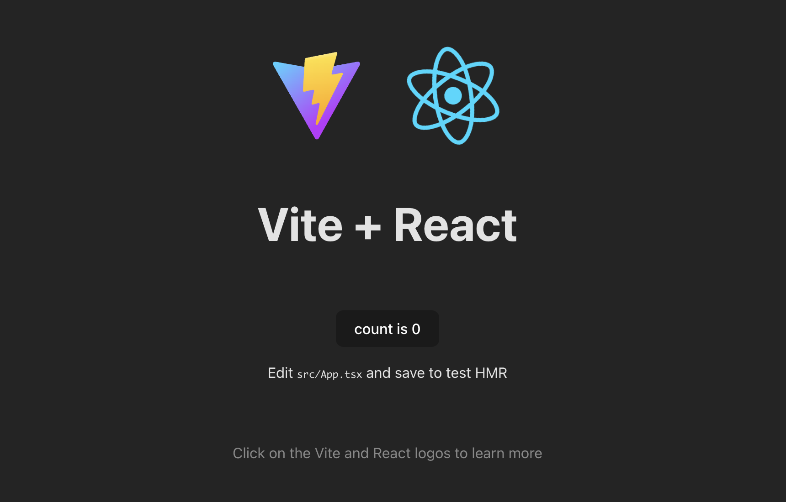

<!-- omit in toc -->
# Reactの基本動作

<!-- omit in toc -->
## 目次
- [Reactを動かしてみる](#reactを動かしてみる)
  - [Reactの記法（JSX）](#reactの記法jsx)
- [Reactのコンセプト](#reactのコンセプト)
- [Reactアプリ開発の始め方 (vite)](#reactアプリ開発の始め方-vite)
- [コンポーネントの作成](#コンポーネントの作成)
- [コンポーネント間の値の受け渡し（props）](#コンポーネント間の値の受け渡しprops)
  - [propsの特殊な例（children）](#propsの特殊な例children)
- [特殊なコンポーネントReact.Fragment](#特殊なコンポーネントreactfragment)
- [Next: Chapter３ スタイリング](#next-chapter３-スタイリング)
- [Prev: Chapter1 Reactの開発環境の準備](#prev-chapter1-reactの開発環境の準備)

## Reactを動かしてみる
以下のhtmlファイルを作成して、reactを動かしてみましょう。ここでの記述方法は、通常の開発で使うことはありませんので、覚える必要はありません。ここでは、Reactがどのような手順でhtmlに変更を加えているのかを確認してください。好きなディレクトリに以下の`index.html`を作成してください。

`index.html`
```html
<!DOCTYPE html>
<html>
<head>
  <script src="https://unpkg.com/react@18/umd/react.development.js"></script>
  <script src="https://unpkg.com/react-dom@18/umd/react-dom.development.js"></script>
  <script src="https://unpkg.com/babel-standalone@6/babel.min.js"></script>
</head>
<body>
    <div id="app"></div>
    <script>
        const appElement = document.querySelector('#app');
        const root = ReactDOM.createRoot(appElement);
        root.render("Hello React");
    </script>
</body>
</html>
```

作成したindex.htmlをWebブラウザで開いてください。「Hello React」の文字が表示されれば成功です。


`head`タグ内では、Reactを動かすためのライブラリを読み込んでいます。

`body`タグ内に記述したscriptによって、`<div id="app"></div>`の中に、`root.render`の引数が挿入されます。
`root.render`の引数を色々変えてみましょう。

### Reactの記法（JSX）
Reactでは、HTMLタグ(に似たもの)をjavascriptに直接記述する特殊な記法を使います。一般的にこの記法は、JSXと呼ばれています。
先ほどのhtmlをJSXの記法を使って書き換えてみましょう。

`sample.html`の`body`タグ
```html
<body>
    <div id="app"></div>
    <script>
        const appElement = document.querySelector('#app');
        const root = ReactDOM.createRoot(appElement);
        root.render(<h1>Hello</h1>);
    </script>
</body>
```

このように変更すると、エラーが発生していることが分かります。これは、通常のjavascriptでは、`<h1>Hello React</h1>`のようなhtmlタグのような記述ができないためです。

Reactでは、babelというライブラリが、Reactのコードをjavascriptに変換するようになっています。babelがReactのコードを変換してくれるように、`sample.html`を以下のように編集しましょう。


`sample.html`の`body`タグ
```html
<body>
    <div id="app"></div>
    <script type="text/babel">
        const appElement = document.querySelector('#app');
        const root = ReactDOM.createRoot(appElement);
        root.render(<h1>Hello React</h1>);
    </script>
</body>
```

これで、正しく動作するはずです。

## Reactのコンセプト

Reactでは、コンポーネントと呼ばれる単位で、コードを記述していきます。コンポーネントとは、画面の各構成要素をReactで定義したものです。
これによって、コードが整理され、使い回しができ、疎結合になります。

それでは、先ほどのhtmlを編集して、コンポーネントを定義していきましょう。

`sample.html`の`body`タグ
```html
<body>
    <div id="app"></div>
    <script type="text/babel">
        const appElement = document.querySelector('#app');
        const root = ReactDOM.createRoot(appElement);

        const Hello = () => {
            return <h1>Hello React</h1>
        }

        root.render(<Hello />);
    </script>
</body>
```

コンポーネントは、以下のように関数で定義し、必ず最初の文字を大文字で定義します。

```javascript
const Hello = () => {
    return <h1>Hello React</h1>
}
```

※コンポーネントをクラスで記述するものもありますが、これは以前のReactの記法です。すごく特殊な場合を除いては、関数でコンポーネントを定義しましょう。

## Reactアプリ開発の始め方 (vite)
ここから本格的にReactのプロジェクトを作っていきましょう。reactのプロジェクトは、`vite`を利用することで、簡単に始めることができます。
以下ようなコマンドで、Reactのtemplateを生成することができます。(node.jsをインストールする必要があります。)

```shell
npm create vite@latest
```

コマンド実行後、いくつか質問されるので、それに答えていきます。

まず、project名を設定します。
デフォルトは、`vite-project`となっています。
```shell
? Project name: > vite-project
```

次に、どのフレームワークを利用するか答えます。
ここでは、`React`を選択しましょう。
```shell
? Select a framework: › - Use arrow-keys. Return to submit.
❯   Vanilla
    Vue
    React
    Preact
    Lit
    Svelte
    Solid
    Qwik
    Others
```

次に、TypescriptかJavascriptを選択します。[SWR](https://swc.rs/)は、高速なコンパイラです。特に理由がなければ、`+ SWR`の方を選択してください。

ここでは、Typescriptで解説をしていくので、`TypeScript + SWC`を選択してください。
```shell
? Select a variant: › - Use arrow-keys. Return to submit.
❯   TypeScript
    TypeScript + SWC
    JavaScript
    JavaScript + SWC
```

これで、テンプレートが作成されます。ただライブラリ等はインストールされていない状態なので、以下のコマンドでインストールをしていきます。

```shell
cd {プロジェクト名}
npm install
```

インストール終了したら、プロジェクトディレクトリ配下の構成は、以下のようになっているはずです。

```
.
├── README.md
├── index.html
├── package.json
├── public
├── src
├── tsconfig.json
├── tsconfig.node.json
└── vite.config.ts
```

開発サーバを立ち上げてみましょう。開発サーバの立ち上げは、以下のコマンドです。
```shell
npm run dev
```
デフォルトでは、[http://localhost:5173/](http://localhost:5173/)がブラウザで開かれ、画面を見ることができます。以下のような画面が表示されれば、成功です。



それでは、ファイルの中身を見ていきましょう。プロジェクトディレクトリ直下にある`index.html`を開いてみてください。以下のような内容になっているはずです。

`index.html`
```html
<!doctype html>
<html lang="en">
  <head>
    <meta charset="UTF-8" />
    <link rel="icon" type="image/svg+xml" href="/vite.svg" />
    <meta name="viewport" content="width=device-width, initial-scale=1.0" />
    <title>Vite + React + TS</title>
  </head>
  <body>
    <div id="root"></div>
    <script type="module" src="/src/main.tsx"></script>
  </body>
</html>
```

これが、ベースとなるhtmlファイルです。`body`タグにある`<div id="root"></div>`の中は、Reactで構成していく部分になります。

`head`タグ内は、必要に応じて変更してください。特に`<html lang="en">`の部分は、開発している画面の言語に合うように設定を変えてください。日本語の場合は、`<html lang="ja">`です。
また、アイコンなどもviteのものになっているので、変更するようにしてください。

次にsrcディレクトリの中を見てみましょう。ここには、ソースコードが格納されています。通常、typescriptのソースコードの拡張子は、`.ts`ですが、Reactでは、上で紹介したJSXという記法を使うため、コンポーネントを記述する場合は、拡張子も変わり、`.tsx`となります。(javascriptの場合は、`.jsx`)

`src/main.tsx`を開いてみてください。

`src/main.tsx`
```javascript
import React from 'react'
import ReactDOM from 'react-dom/client'
import App from './App.tsx'
import './index.css'

ReactDOM.createRoot(document.getElementById('root')!).render(
  <React.StrictMode>
    <App />
  </React.StrictMode>,
)
```

ここの内容は、HTMLに直接記述したものと同じような内容であることが分かると思います。
このスクリプトによって、`index.html`の`<div id="root"></div>`の中に、`root.render`の引数が挿入されます。
`root.render`の引数である`React.StrictMode`, `App`は、コンポーネントになります。`React.StrictMode`は、開発時にバグを見つけやすくするようにするもので、画面は何も変わりませんが、プログラムの挙動が変わります。

`React.StrictMode`によって以下のような挙動が追加されます。（参考：[StrictMode - React](https://ja.react.dev/reference/react/StrictMode)）
- レンダー（画面描画）を追加で1回行う。
- エフェクト(useEffectで指定した内容)の実行を追加で1回行う。
- 非推奨のAPIを使用していないかチェックする。

次は、`App`コンポーネントについてみてみましょう。`src/App.tsx`を開いてください。

`src/App.tsx`
```javascript
import { useState } from 'react'
import reactLogo from './assets/react.svg'
import viteLogo from '/vite.svg'
import './App.css'

function App() {
  const [count, setCount] = useState(0)

  return (
    <>
      <div>
        <a href="https://vitejs.dev" target="_blank">
          
        </a>
        <a href="https://react.dev" target="_blank">
          
        </a>
      </div>
      <h1>Vite + React</h1>
      <div className="card">
        <button onClick={() => setCount((count) => count + 1)}>
          count is {count}
        </button>
        <p>
          Edit <code>src/App.tsx</code> and save to test HMR
        </p>
      </div>
      <p className="read-the-docs">
        Click on the Vite and React logos to learn more
      </p>
    </>
  )
}

export default App
```

ここには、実際にブラウザの画面上に表示されているものが定義されていることが分かると思います。後の章で説明しますが、`useState`を使った状態管理も行なっています。

それでは、この`App.tsx`をもっと単純なものに書き換えてみましょう。

```javascript
function App() {
  return (
    <h1>Hello React</h1>
  );
}

export default App;
```

これで、HTMLに直接記述したときと同じ内容になっているはずです。ブラウザ画面を見てみてください。
`npm run dev`を終了させた人は、`npm run dev`を実行して、[http://localhost:5173/](http://localhost:5173/)をブラウザで開いてください。

以下のような画面になっていれば、成功です。


## コンポーネントの作成

それでは、コンポーネントを作成してみましょう。

コンポーネントを定義する際には、基本的に以下のルールがあります。
- コンポーネントは、パスカルケース
- １つのファイルにつき、１つのコンポーネント
- コンポーネントのファイル名　＝　コンポーネント名

１つのファイルにつき、１つのコンポーネントというルールは慣習的で、実際に１つのファイルに複数のコンポーネントを定義しても、エラーにはなりません。
ディレクトリ構成は様々ありますが、１つのファイルに１つのコンポーネントというルールは、守られていることが多いようです。

ここでは、とりあえず`components`というディレクトリを作成し、その配下にコンポーネントを定義したファイルを配置していきましょう。
それでは、以下のディレクトリ、ファイルを作成し、`Hello`コンポーネントを作成していきましょう。

`src`ディレクトリ配下に、`components`ディレクトリを作成し、その中に`Hello.tsx`を作成してください。
`Hello`コンポーネントを作成するので、`Hello.tsx`というファイル名になります。

```
.
└── src
    └──components
        └── Hello.tsx
```

`Hello.tsx`
```javascript
const Hello: React.FC = () => {
    return <h1>Hello React</h1>
}

export default Hello
```

それでは、作成したHelloコンポーネントを使って、`App.tsx`を書き換えましょう。

`App.tsx`
```javascript
import Hello from "./components/Hello";

function App() {
  return (
    <Hello />
  );
}

export default App;
```

ブラウザ画面を確認してみましょう。`npm run dev`を終了させた人は、`npm run dev`を実行して、[http://localhost:5173/](http://localhost:5173/)をブラウザで開いてください。
プログラムの記述は変わりましたが、表示されている内容は変わっていないはずです。

## コンポーネント間の値の受け渡し（props）
Reactはコンポーネントという単位で、細かくコードを分けていくので、コンポーネント間で値を共有したい場合がよくあります。(今はまだかもしれませんが)
コンポーネント間での値の受け渡しには、propsを使います。このpropsは、コンポーネント関数の引数となる部分で、必ずjavascriptのオブジェクトになります。

それでは、Appコンポーネントから、Helloコンポーネントにstringを渡してみましょう。

まず、値を渡す側Appは、以下のように記述します。
```javascript
function App() {
  return (
    <Hello target="React"/>
  );
}
```

このようにすると、Helloコンポーネントに以下のようなオブジェクトが渡されます。
```javascript
{ target: "React" }
```
それでは、Helloコンポーネントでは、どのように値が渡されているか確認しましょう。
Helloコンポーネントの中身を以下のように変更してください。

```javascript
interface HelloProps {
  target: string;
}

const Hello: React.FC<HelloProps> = (props) => {
  console.log(props)
  return <h1>Hello React</h1>
}
```

Chromeの検証ツールからコンソールの出力を確認してみましょう。

それでは、propsで渡された値を使ってみましょう。javascriptの分割代入を使うことで、propsの中身を受け取ります。

```javascript
const Hello: React.FC<HelloProps> = ({ target }) => {
  return <h1>Hello {target}</h1>;
};
```

ここで、`<h1>`タグ内をみてください。変数`target`は、`{target}`として渡しています。単に`target`としてしまうと、文字列のtargetと認識されてしまいます。そのため、JSX記法で、HTMLタグ内やコンポーネント内で変数やオブジェクトを使う場合、`{}`をつけましょう。

### propsの特殊な例（children）
propsで渡す値の中で`children`は、渡し方が異なります。この`children`は、`<h1>Hello React</h1>`で言うと`Hello React`の部分になります。この例では、HTMLタグでしたが、コンポーネントでも同じように値を渡すことができます。

また、`children`は文字列だけでなく、HTML要素やコンポーネントを渡すことができます。

それでは、`Hello`コンポーネントが`children`を受け取るように改造しましょう。

`Hello.tsx`
```javascript
interface HelloProps {
  target: string;
  children: React.ReactNode;
}

const Hello: React.FC<HelloProps> = ({ target, children }) => {
  return (
    <div>
      <h1>Hello {target}</h1>
      {children}
    </div>
  );
};

export default Hello;
```

次にHelloコンポーネントを使っている`App.tsx`も修正しましょう。

`App.tsx`
```javascript
function App() {
  return <Hello target="React">Hi</Hello>;
}
```

それでは、ブラウザ画面を開いてください。`npm run dev`を終了させた人は、`npm run dev`を実行して、[http://localhost:5173/](http://localhost:5173/)をブラウザで開いてください。

以下のような画面が表示されれば、成功です。


この`children`には、今回のように文字列は、もちろんですが、HTML要素、コンポーネントも渡すことができます。以下のように色々変更してみてください。

```javascript
function App() {
  return (
    <Hello target="React">
      <button>Hi</button>
    </Hello>
  );
}
```

## 特殊なコンポーネントReact.Fragment
Reactコンポーネントには、必ず１つの要素を返すというルールがあります。（複数の要素を変えることはできない）

例えば、以下のように複数のHTML要素を変えそうとすると、エラーになることが分かります。
```javascript
const Hello = () => {
  return <div>Hello</div><div>React</div>;
}
```

ただ、状況によっては、複数の要素を返すようなコンポーネントを作りたいことがあります。その時に利用するのが`React.Fragment`です。`React.Fragment`は、以下のコードに示すように`<>...</>`という構文で表せます。

```javascript
const Hello = () => {
  return (
    <>
      <div>Hello</div>
      <div>React</div>
    </>
  );
};
```

この`React.Fragment`は、React上では、一つの要素（コンポーネント）と解釈されますが、Reactが最終的に生成するHTMLでは、`React.Fragment`は消えた状態になります。

## [Next: Chapter３ スタイリング](../chapters/chapter3.md)

## [Prev: Chapter1 Reactの開発環境の準備](../chapters/chapter1.md)