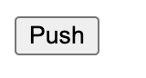
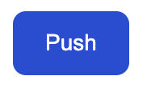
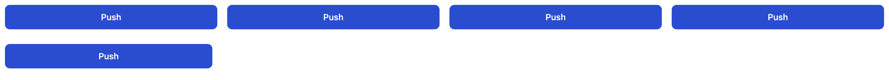

<!--  -->

<!-- omit in toc -->
# スタイリング

<!-- omit in toc -->
## 目次
- [スタイリングを行うコンポーネントの追加](#スタイリングを行うコンポーネントの追加)
- [Raw CSS](#raw-css)
- [style props](#style-props)
- [CSS Moldules](#css-moldules)
  - [CSS Modulesの注意点](#css-modulesの注意点)
- [CSS in JS](#css-in-js)
  - [styled-componentsについて](#styled-componentsについて)
  - [styled-componentsのインストール](#styled-componentsのインストール)
  - [styled-componentsの利用](#styled-componentsの利用)
- [Tailwind](#tailwind)
  - [Tailwindについて](#tailwindについて)
  - [Tailwindのインストール](#tailwindのインストール)
  - [VSCodeの拡張機能のインストール](#vscodeの拡張機能のインストール)
  - [Tailwindの利用](#tailwindの利用)
  - [Tailwindの自動並び替え（スキップ可）](#tailwindの自動並び替えスキップ可)
  - [Tailwindの注意点（動的なスタイル）](#tailwindの注意点動的なスタイル)
- [まとめ](#まとめ)
- [Next: Chapter4 状態管理 useState](#next-chapter4-状態管理-usestate)
- [Prev: Chapter2 Reactの基本動作](#prev-chapter2-reactの基本動作)

## スタイリングを行うコンポーネントの追加
スタイリングの対象となるボタンコンポーネントを作りましょう。

以下の`src/components/StyledButton.tsx`を作成してください。
`src/components/StyledButton.tsx`
```jsx
const StyledButton: React.FC = () => {
  return (
    <>
      <button>Push</button>
    </>
  );
};

export default StyledButton;
```

このボタンが画面に表示されるように、`App`コンポーネントも変更しましょう。
`src/App.tsx`
```jsx
import StyledButton from "./components/StyledButton";

function App() {
  return (
    <>
      <StyledButton />
    </>
  );
}

export default App;
```

また、viteでプロジェクトのテンプレートを作成した場合、デフォルトのスタイル`index.css`を`main.tsx`で読み込んでいるので、`index.css`の中身は、空にしておきましょう。

`src/index.css`
```css
/* empty */
```

`npm run dev`を実行し、[http://localhost:5173/](http://localhost:5173/)をブラウザで開いてください。
以下のようなボタンが表示されます。



## Raw CSS
スタイリングのやり方について説明します。まずは、一番シンプルなcssファイルを読み取る方法です。

まず、cssを定義しましょう。以下のcssファイルを作成してください。
`src/components/cutom-button.css`
```css
.custom-button {
  padding-top: 0.625rem;
  padding-bottom: 0.625rem;
  padding-left: 1.25rem;
  padding-right: 1.25rem;
  margin-bottom: 0.5rem;
  border-radius: 0.5rem;
  font-size: 0.875rem;
  line-height: 1.25rem;
  font-weight: 500;
  color: #ffffff;
  background-color: #1d4ed8;
}

.custom-button:hover {
  background-color: #1e40af;
}

.custom-button:focus {
  outline-style: solid;
  outline-width: 4px;
  outline-color: #93c5fd;
}
```

それでは、`StyledButton.tsx`のbutton要素にクラス名をつけましょう。htmlでは、通常`class`でクラス名を指定しますが、Reactでは、`class`がjavascriptのクラスと名前が被ってしまうため、`className`で指定します。

また、定義したcssも読み込む必要がありますので、cssファイルをimportしましょう。

`StyledButton.tsx`を以下のように修正しましょう。

`src/components/StyledButton.tsx`
```jsx
import "./custom-button.css";

const StyledButton: React.FC = () => {
  return (
    <>
      <button className="custom-button">Push</button>
    </>
  );
};

export default StyledButton;
```

ブラウザを確認すると以下のようなボタンが表示されているはずです。
また、少し触ってみて、hoverやfocus時のスタイルも確認してみましょう。



ただし、cssファイルを読み込ませた場合、グローバルに適用されます。そのため、**全体に適用したいスタイルのみ記述**するようにしましょう。

全体に適用したいスタイルは、この`index.css`に定義するようにし、`main.tsx`で読み込むようにしましょう。

各コンポーネントに適用するスタイルに、cssを使用することもできますが、このやり方だと名前の衝突が問題になります。もし、同じ名前のスタイルが定義されていた場合、後から読み込まれたスタイルが上書きされてしまいます。

**各コンポーネントで使うスタイルは、以下で紹介するCSS Modules, CSS in JS, Tailwindのいずれかを利用してください。**

## style props
ReactでHTML要素を使う場合に、style propsを渡すことができます。このやり方だと、HTML要素に直接スタイルを記述するので、名前の衝突がありません。また、javascriptの変数も使うことができるので、動的なスタイルも適用できます。

style propsは以下のように適用します。`StyledButton.tsx`にボタンを追加し、cssで記述したスタイルをそのままstyle propsに記述していきます。コンポーネントを以下のように修正しましょう。

また、今後ボタンが複数並ぶので、みやすいようにgridも作成しています。

```jsx
const StyledButton: React.FC = () => {
  return (
    <div
      style={{
        display: "grid",
        gridTemplateColumns: "repeat(4, minmax(0, 1fr))",
        gap: "1rem",
      }}
    >
      <button className="custom-button">Push</button>
      <button
        style={{
          paddingTop: "0.625rem",
          paddingBottom: "0.635rem",
          paddingLeft: "1.25rem",
          paddingRight: "1.25rem",
          marginBottom: "0.5rem",
          borderRadius: "0.5rem",
          fontSize: "0.875rem",
          lineHeight: "1.25rem",
          fontWeight: 500,
          color: "#ffffff",
          backgroundColor: "#1d4ed8",
          borderStyle: "none",
        }}
      >
        Push
      </button>
    </div>
  );
};
```

こうすることで、同じようなボタンが2つ並びます。


ただし、style propsでは、hoverとfocusは、後で紹介する状態管理を使って行う必要があるので、ここでは適用していません。

style propsはパフォーマンスが悪いため、あまり多用しない方が良いでしょう。名前の衝突の回避や動的なスタイルの適用は、後に紹介する方法でもできます。

## CSS Moldules
cssをそのまま使った場合にあった問題：名前の衝突を回避するために使われるのが、css modulesです。

css modulesでは、cssは通常通り記述するのですが、最終的に適用されるクラス名が自動生成されたものになるので、名前の衝突が回避できるようになります。

[Raw CSS](#raw-css)で作成したcssファイルと中身が同じものを用意します。
ファイル名は、`custom-button.module.css`としてください。cssの前に`module`と入れることで、CSS Modulesとして認識してくれます。

以下のファイルを作成してください。

`src/components/custom-button.module.css`
```css
.custom-button {
  padding-top: 0.625rem;
  padding-bottom: 0.625rem;
  padding-left: 1.25rem;
  padding-right: 1.25rem;
  margin-bottom: 0.5rem;
  border-radius: 0.5rem;
  font-size: 0.875rem;
  line-height: 1.25rem;
  font-weight: 500;
  color: #ffffff;
  background-color: #1d4ed8;
  border-style: none;
}

.custom-button:hover {
  background-color: #1e40af;
}

.custom-button:focus {
  outline-style: solid;
  outline-width: 4px;
  outline-color: #93c5fd;
}
```

それでは、作成したファイルを読み込んでいきましょう。
CSS Modulesでは、以下のようにimportして使います。
```jsx
import styles from "./custom-button.module.css"
```
このimportした`styles`を見てみると
```json
{"custom-button":"_custom-button_1317u_1"}
```
となっており、`"_custom-button_1317u_1"`は、自動生成されたクラス名です。したがって、`styles["custom-button"]`を`className`に指定しましょう。
```jsx
<button className={styles["custom-button"]}>Push</button>
```

`StyledButton.tsx`を以下のように修正しましょう。

`src/components/StyledButton.tsx`
```jsx
import "./custom-button.css";
import styles from "./custom-button.module.css";

const StyledButton: React.FC = () => {
  return (
    <div
      style={{
        display: "grid",
        gridTemplateColumns: "repeat(4, minmax(0, 1fr))",
        gap: "1rem",
      }}
    >
      <button className="custom-button">Push</button>
      <button
        style={{
          paddingTop: "0.625rem",
          paddingBottom: "0.635rem",
          paddingLeft: "1.25rem",
          paddingRight: "1.25rem",
          marginBottom: "0.5rem",
          borderRadius: "0.5rem",
          fontSize: "0.875rem",
          lineHeight: "1.25rem",
          fontWeight: 500,
          color: "#ffffff",
          backgroundColor: "#1d4ed8",
          borderStyle: "none",
        }}
      >
        Push
      </button>
      <button className={styles["custom-button"]}>Push</button>
    </div>
  );
};

export default StyledButton;
```

`npm run dev`を実行し、開発サーバーで実行結果を確認すると、同じボタンが3つ並ぶことが確認できます。

以上が、CSS Modulesの使い方です。cssの書き方は、変わらないので、すでにcssを使い慣れている人におすすめの方法です。

### CSS Modulesの注意点

CSS Modulesは、css-loaderのメンテナーがCSS Moduleを非推奨にしたいと意思表明があり、近々非推奨になるのではないかと言われていたり、一方でNext.jsでは公式ドキュメントでCSS Moduleを推奨にするようにしたいと言うIssueが立てられたりなど、CSS Modulesが、今後どうなっていくのか不透明な状態です。

[CSS Modulesの歴史、現在、これから - Hatena Developer Blog](https://developer.hatenastaff.com/entry/2022/09/01/093000#CSS-Modules%E3%81%AE%E3%83%A1%E3%83%B3%E3%83%86%E3%83%8A%E3%83%B3%E3%82%B9%E7%8A%B6%E6%B3%81)


ここからは、筆者個人の意見ですが、CSS Modulesは、cssに使い慣れている人にとっては、非常に強力なツールですので、既にcssで使い慣れている人は、使ってもいいかと思います。

逆にcssを使い慣れていない人は、次に紹介するCSS-in-JSやTailwindを使うのが安全かと思います。


## CSS in JS
CSS-in-JSとは、外部ファイル(cssファイル)にスタイルを定義するのではなく、Javascriptにスタイルを定義するものです。

CSS-in-JSのメリット
- ファイル数が減る。
- cssの記述の方法がほぼ同じ
- 動的なスタイルが作りやすい。
- スタイルの適用対象がわかりやすい。

CSS-in-JSのライブラリは、複数ありますが、ここでは、最も利用されているstyled-componentsを取り扱います。

### styled-componentsについて
styled-componentsでは、以下の公式サイトのサンプルのように、HTML要素にスタイルをつけたものをコンポーネントとして定義することができるようになります。
```jsx
import styled from "styled-components";

// Create a Title component that'll render an <h1> tag with some styles
const Title = styled.h1`
  font-size: 1.5em;
  text-align: center;
  color: #BF4F74;
`;

// Create a Wrapper component that'll render a <section> tag with some styles
const Wrapper = styled.section`
  padding: 4em;
  background: papayawhip;
`;

// Use Title and Wrapper like any other React component – except they're styled!
render(
  <Wrapper>
    <Title>
      Hello World!
    </Title>
  </Wrapper>
);
```

また、styled-compoentnsは、コンポーネントなので、以下のようにpropsを渡すこともでき、動的なスタイルも定義できます。
```jsx
import styled from "styled-components";

const Button = styled.button<{ $primary?: boolean; }>`
  /* Adapt the colors based on primary prop */
  background: ${props => props.$primary ? "#BF4F74" : "white"};
  color: ${props => props.$primary ? "white" : "#BF4F74"};

  font-size: 1em;
  margin: 1em;
  padding: 0.25em 1em;
  border: 2px solid #BF4F74;
  border-radius: 3px;
`;

render(
  <div>
    <Button>Normal</Button>
    <Button $primary>Primary</Button>
  </div>
);
```

### styled-componentsのインストール
それでは、styled-componentsをインストールしましょう。
プロジェクトのディレクトリに移動して、npmでインストールします。
```shell
cd vite-project
npm install styled-components
```

### styled-componentsの利用
ここからstyled-componentsを実際に使っていくのですが、
styled-componentsは、javascriptにcssを記述するため、デフォルトだと予測変換やシンタックスハイライトが効かないので、拡張機能を入れると便利です。

まず、vscodeの拡張機能[vscode-styled-components](https://marketplace.visualstudio.com/items?itemName=styled-components.vscode-styled-components)をインストールしましょう。

それでは、[Raw CSS](#raw-css)で定義したものと全く同じスタイルのボタンをstyled-componentsで作ってみましょう。

`StyledButton.tsx`に以下の記述を追加してください。

```jsx
import styled from "styled-components";

const CustomButton = styled.button`
  padding-top: 0.625rem;
  padding-bottom: 0.625rem;
  padding-left: 1.25rem;
  padding-right: 1.25rem;
  margin-bottom: 0.5rem;
  border-radius: 0.5rem;
  font-size: 0.875rem;
  line-height: 1.25rem;
  font-weight: 500;
  color: #ffffff;
  background-color: #1d4ed8;
  border-style: none;

  &:hover {
    background-color: #1e40af;
  }

  &:focus {
    outline-style: solid;
    outline-width: 4px;
    outline-color: #93c5fd;
  }
`;
```

ここで、定義した`CustomButton`を`StyledButton`コンポーネントに追加しましょう。

```jsx
const StyledButton: React.FC = () => {
  return (
    <div
      style={{
        display: "grid",
        gridTemplateColumns: "repeat(4, minmax(0, 1fr))",
        gap: "1rem",
      }}
    >
      <button className="custom-button">Push</button>
      <button
        style={{
          paddingTop: "0.625rem",
          paddingBottom: "0.635rem",
          paddingLeft: "1.25rem",
          paddingRight: "1.25rem",
          marginBottom: "0.5rem",
          borderRadius: "0.5rem",
          fontSize: "0.875rem",
          lineHeight: "1.25rem",
          fontWeight: 500,
          color: "#ffffff",
          backgroundColor: "#1d4ed8",
          borderStyle: "none",
        }}
      >
        Push
      </button>
      <button className={styles["custom-button"]}>Push</button>
      <CustomButton>Push</CustomButton>
    </div>
  );
};
```

`npm run dev`を実行し、開発サーバーで実行結果を確認すると、同じボタンが4つ並ぶことが確認できます。

以上が、styled-componentsの使い方です。CSS in JSは、styled-componentsの他にも[Emotion](https://emotion.sh/docs/introduction)や[Linaria](https://linaria.dev/)などがあります。

emotionは、styled-componentsを拡張したもので、styled-componentsと同じ記法も使えますが、以下のようにcssとcssというpropsに渡すことでもスタイルを定義することができます。
```jsx
import { css } from '@emotion/react'

const color = 'white'

render(
  <div
    css={css`
      padding: 32px;
      background-color: hotpink;
      font-size: 24px;
      border-radius: 4px;
      &:hover {
        color: ${color};
      }
    `}
  >
    Hover to change color.
  </div>
)
```
また、Emotionは、[Material UI](https://mui.com/)でも使うことができるので、Material UIの利用を考えている場合は、Emotionを利用するのが良さそうです。


styled-componentsに拘らず、自分のニーズに合ったライブラリを利用しましょう。


## Tailwind

Tailwindのメリット
- ファイル数が減る。
- クラス名を考える必要がない。
- クラス名からスタイルが分かる。

### Tailwindについて
tailwindは、cssだと`display: flex;`を適用させたい場合は、クラス名に`flex`を指定していきます。

例えば、cssだと以下のような指定がしたい場合、
```css
{
  display: flex; 
  padding-top: 0.75rem;
  padding-bottom: 0.75rem; 
  padding-left: 1rem;
  padding-right: 1rem; 
  align-items: center; 
  color: #ffffff; 
  background-color: #3B82F6;
}

:hover {
  background-color: #60A5FA; 
}
```

tailwindを利用すると以下をclassNameに指定することになります。
```jsx
className="flex items-center px-4 py-3 text-white bg-blue-500 hover:bg-blue-400"
```

### Tailwindのインストール
まず、Tailwindのインストール手順です。
公式サイトの案内は、[こちら](https://tailwindcss.com/docs/guides/vite)にあります。

まず、viteで作成したプロジェクトのディレクトリに移動します。
```shell
cd vite-project
```

次に、tailwindとその関連ライブラリをインストールします。
```shell
npm install -D tailwindcss postcss autoprefixer
```

次に、Tailwindの初期化処理を行います。
```shell
npx tailwindcss init -p
```

上記コマンド実行後、`tailwind.config.js`というファイルが作成されるので、Tailwindを使うファイルを以下のように指定します。
```jsx
/** @type {import('tailwindcss').Config} */
export default {
  content: ["./index.html", "./src/**/*.{js,ts,jsx,tsx}"],
  theme: {
    extend: {},
  },
  plugins: [],
};
```

次に`src/index.css`の先頭に以下の内容を追加します。

`src/index.css`
```css
@tailwind base;
@tailwind components;
@tailwind utilities;
```

以上で、Tailwindが使えるようになります。

※Tailwindを利用する場合、デフォルトで設定されるスタイルは、すべてクリアされ、適用されません。

### VSCodeの拡張機能のインストール
Tailwindは、独自の構文を使っているので、予測変換が効くようにVSCodeの以下の拡張機能をインストールしましょう。

[Tailwind CSS IntelliSense](https://marketplace.visualstudio.com/items?itemName=bradlc.vscode-tailwindcss)

デフォルトの設定だと補完が遅いので、VSCodeの設定を変更します。`setting.json`に以下を追加してください。

`setting.json`
```json
"editor.quickSuggestions": {
  "strings": true
}
```

### Tailwindの利用
それでは、ここから実際にTailwindを利用していきましょう。

まず、デフォルトのスタイルが適用されなくなるので、見やすさのために、`App.tsx`を以下のように修正してください。

`src/App.tsx`
```jsx
import StyledButton from "./components/StyledButton";

function App() {
  return (
    <div className="m-2">
      <StyledButton />
    </div>
  );
}

export default App;
```

それでは、Tailwindでこれまでと同じボタンを作っていきましょう。
Tailwindを使うと以下のようになります。
```jsx
<button className="mb-2 me-2 rounded-lg bg-blue-700 px-5 py-2.5 text-sm font-medium text-white hover:bg-blue-800 focus:outline-none focus:ring-4 focus:ring-blue-300">
  Push
</button>
```

このボタンを`StyledButton.tsx`に追加します。

`src/components/StyledButton.tsx`
```jsx
import "./custom-button.css";
import styles from "./custom-button.module.css";
import styled from "styled-components";

const CustomButton = styled.button`
  padding-top: 0.625rem;
  padding-bottom: 0.625rem;
  padding-left: 1.25rem;
  padding-right: 1.25rem;
  margin-bottom: 0.5rem;
  border-radius: 0.5rem;
  font-size: 0.875rem;
  line-height: 1.25rem;
  font-weight: 500;
  color: #ffffff;
  background-color: #1d4ed8;
  border-style: none;

  &:hover {
    background-color: #1e40af;
  }

  &:focus {
    outline-style: solid;
    outline-width: 4px;
    outline-color: #93c5fd;
  }
`;

const StyledButton: React.FC = () => {
  return (
    <div
      style={{
        display: "grid",
        gridTemplateColumns: "repeat(4, minmax(0, 1fr))",
        gap: "1rem",
      }}
    >
      <button className="custom-button">Push</button>
      <button
        style={{
          paddingTop: "0.625rem",
          paddingBottom: "0.635rem",
          paddingLeft: "1.25rem",
          paddingRight: "1.25rem",
          marginBottom: "0.5rem",
          borderRadius: "0.5rem",
          fontSize: "0.875rem",
          lineHeight: "1.25rem",
          fontWeight: 500,
          color: "#ffffff",
          backgroundColor: "#1d4ed8",
          borderStyle: "none",
        }}
      >
        Push
      </button>
      <button className={styles["custom-button"]}>Push</button>
      <CustomButton>Push</CustomButton>
      <button className="mb-2 me-2 rounded-lg bg-blue-700 px-5 py-2.5 text-sm font-medium text-white hover:bg-blue-800 focus:outline-none focus:ring-4 focus:ring-blue-300">
        Push
      </button>
    </div>
  );
};

export default StyledButton;
```

`npm run dev`を実行してブラウザで確認してみましょう。



### Tailwindの自動並び替え（スキップ可）
Tailwindは、classNameにずらっとユーティリティクラスが並ぶ形になります。その際にユーティリティクラスの並び順がバラバラだと見づらくなってしまいます。

そこで、Tailwind公式がprettierのプラグインとしてTailwindのユーティリティクラスを並び替えしてくれる機能を開発しているので、Tailwindを使う場合は、これを導入しましょう。

公式の案内は、[こちら](https://tailwindcss.com/blog/automatic-class-sorting-with-prettier)です。

まず、以下のコマンドでprettierとprettierのプラグインを入れます。

```shell
npm install -D prettier prettier-plugin-tailwindcss
```

次に、prettierがプラグインを認識してくれるように、プロジェクトディレクトリに以下の内容の`.prettierrc`というファイルを作成してください。

`.prettierrc`
```json
{
  "plugins": ["prettier-plugin-tailwindcss"]
}
```

### Tailwindの注意点（動的なスタイル）

Tailwindで動的なスタイルを定義しようとした時に、うまくスタイルが反映されない場合があります。うまくいかない例とうまくいく例をみていきましょう。

<!-- omit in toc -->
#### うまくいかない例
`App.tsx`を以下のようにしてみましょう。

`src/App.tsx`
```jsx
import StyledButton from "./components/StyledButton";

function App() {
  let marginSize = 4;
  return (
    <div className={`m-${marginSize}`}>
      <StyledButton />
    </div>
  );
}

export default App;
```

これで、`npm run dev`でブラウザで実行結果を確認するとmarginが適用されていないはずです。

<!-- omit in toc -->
#### うまくいく例
今度は、`App.tsx`を少し変えて、以下のようにします。

`src/App.tsx`
```jsx
import StyledButton from "./components/StyledButton";

function App() {
  let marginSize = "big";
  return (
    <div className={`${marginSize === "big" ? "m-4" : "m-2"}`}>
      <StyledButton />
    </div>
  );
}

export default App;
```

この違いが起こる理由は、tailwindのユーティリティクラスは、ソースコードを静的に解析を行い、そこで使用されているユーティリティクラスを検知し、実際のcssに反映させる仕組みになっています。

そのため、`m-${marginSize}`と記述するとTailwindのユーティリティクラスと一致しないため、実際のcssには反映されず、スタイルが適用されないのです。


## まとめ
全体に適用するスタイルは、cssで記述しましょう。各コンポーネントで適用するスタイルは、CSS Modules, CSS in JS, Tailwindの中から自分に合ったものを選びましょう。

本資料では、Tailwind CSSを使っていきます。

## [Next: Chapter4 状態管理 useState](../chapters/chapter4.md)

## [Prev: Chapter2 Reactの基本動作](../chapters/chapter2.md)

<!--  -->