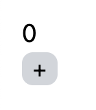

<!-- omit in toc -->
# 状態管理 useState

<!-- omit in toc -->
## 目次
- [準備](#準備)
- [Counterコンポーネントの作成](#counterコンポーネントの作成)
  - [useStateの使い方](#usestateの使い方)
  - [useStateを使った実装](#usestateを使った実装)
- [TextInputコンポーネントの作成](#textinputコンポーネントの作成)
  - [typeによる違い](#typeによる違い)
- [useStateの注意点](#usestateの注意点)
- [Formの作成](#formの作成)


## 準備
まず、今後`App.tsx`に作成したコンポーネントを追加していくので、以下のように修正してください。
また、ここからはスタイリングはTailwindで行なっていきます。

`src/App.tsx`
```javascript
function App() {
  return (
    <div className="m-4 space-y-2">
      {/*ここにコンポーネントを追加していく。*/}
    </div>
  );
}

export default App;
```

## Counterコンポーネントの作成
ここからは、ボタンを押すと画面に表示している数字が増えていくコンポーネントを作成しましょう。以下のファイルを作成してください。

`src/components/Counter.tsx`
```javascript
const Counter: React.FC = () => {
  return (
    <div>
      <div className="text-lg">0</div>
      <button className="rounded-lg bg-gray-300 px-2">+</button>
    </div>
  );
};

export default Counter;
```

作成した`Counter`コンポーネントを`App`コンポーネントに追加しましょう。

`src/App.tsx`
```javascript
import Counter from "./components/Counter";

function App() {
  return (
    <div className="m-4 space-y-2">
      <Counter />
    </div>
  );
}

export default App;
```

`npm run dev`を実行し、実行結果をブラウザで確認しましょう。



この画面上の+ボタンをクリックすると、表示されている数字が増えるような仕組みを組みましょう。

まずは、javascriptの変数を使って実装してみましょう。
変数`count`を用意して、ボタンのクリックイベントに`count += 1`とする関数を設定しましょう。`Counter`コンポーネントは以下のようになります。

`src/components/Counter.tsx`
```javascript
const Counter: React.FC = () => {
  let count = 0;
  return (
    <div>
      <div className="text-lg">{count}</div>
      <button
        className="rounded-lg bg-gray-300 px-2"
        onClick={() => {
          count += 1;
        }}
      >
        +
      </button>
    </div>
  );
};

export default Counter;
```

これでブラウザ画面上のボタンをクリックしてみてください。この設定では、画面上の数字は何も変わりません。これがうまく動作しない理由は、2つあります。

１つ目は、Counterコンポーネント内で変数が宣言されているため、コンポーネントが実行される度に初期化されてしまうためです。この問題を解決するには、変数`count`を関数の外で宣言すれば解決しそうです。

実際にやってみましょう。

```javascript
let count = 0;
const Counter: React.FC = () => {
  return
  // 省略
}
```

これでも表示は変わらないはずです。これは、もう１つの動かない理由に関係します。

２つ目のうまく動作しない理由は、Reactが変数`count`の変更を検知しないためです。Reactでは変更を検知した箇所だけ再計算を行うようになっています。変更を検知していない`Counter`コンポーネントは、再計算されず、初期の`count=0`のままになっています。

### useStateの使い方
そこで使うのが、`useState`です。まずは、`useState`の使い方を見ていきましょう。

`useState`は関数で、引数には保持したい状態の初期値を渡します。引数で何も指定しない場合、`undefined`になります。`useState`の返値は、`[現在の状態, 状態更新の関数]`となります。

```javascript
import { useState } from "react";
const [state, setState] = useState<number>(0);
```

`useState`を使って宣言した変数`state`は、状態が保持されるようになり、Reactが変更を検知するようになります。

状態の更新は、`useState`の２番目の返値の関数によって行うことができます。上記のコードでいうと`setState`です。この関数を使った更新方法は、２通りあります。

- 新しい状態を渡すパターン

`setState`の引数に新しい状態を渡せば、状態が渡した値に更新されます。
```javascript
seState(1)
```

- 更新する処理を渡すパターン

`setState`の引数には、関数を渡すこともできます。その関数の引数は現在の状態で、返値に新しい状態を指定します。
```javascript
setState((prev) => {
  return prev + 1;
})
```

### useStateを使った実装

それでは、`useState`を使って`Counter`コンポーネントを作っていきましょう。

`src/components/Counter.tsx`
```javascript
import { useState } from "react";

const Counter: React.FC = () => {
  const [count, setCount] = useState(0);
  return (
    <div>
      <div className="text-lg">{count}</div>
      <button
        className="rounded-lg bg-gray-300 px-2"
        onClick={() => {
          setCount(count + 1);
        }}
      >
        +
      </button>
    </div>
  );
};

export default Counter;
```

`button`に設定する`onClick`は、以下の２通りの実装方法があります。今回の場合は、どちらでも問題はありません。

```javascript
// 新しい値を指定する方法
onClick={() => {
  setCount(count + 1);
}}

// 更新する関数を指定する方法
onClick={() => {
  setCount((prev) => prev + 1);
}}
```

実際に`npm run dev`を実行して、試してみてください。表示している数字がボタンをクリックする度に増加していれば、成功です。

## TextInputコンポーネントの作成
まずは、以下のファイルを作成しましょう。

`src/components/TextInput.tsx`
```javascript
const TextInput = () => {
  return (
    <div>
      <input type="text" className="rounded-lg border border-gray-300 p-1" />
    </div>
  );
};

export default TextInput;
```

このコンポーネントを`src/App.tsx`に追加しましょう。

`src/App.tsx`
```javascript
import Counter from "./components/Counter";
import TextInput from "./components/TextInput";

function App() {
  return (
    <div className="m-4 space-y-2">
      <Counter />
      <TextInput />
    </div>
  );
}

export default App;
```

`npm run dev`を実行して、ブラウザで実行結果を確認しましょう。以下のようになっているはずです。


この状態でもテキストの入力は可能ですが、javascriptの変数として扱えないので、`useState`を利用して書き換えてみましょう。

`TextInput`コンポーネントを以下のように修正します。

```javascript
import { useState } from "react";

const TextInput = () => {
  const [text, setText] = useState<string>("");
  return (
    <div>
      <input
        type="text"
        className="rounded-lg border border-gray-300 p-1"
        value={text}
        onChange={(e) => {
          setText(e.target.value);
        }}
      />
    </div>
  );
};

export default TextInput;
```

これで入力されたTextをjavascriptの変数として扱うことができるようになりました。

### typeによる違い
HTMLのinput要素は、typeによって様々な形式があります。どのような形式があるかは、以下を参照してください。

[&lt;input&gt;: 入力欄（フォーム入力）要素 - HTML - MDN Web Docs
](https://developer.mozilla.org/ja/docs/Web/HTML/Element/input)

それでは、`type="number"`について試してみましょう。`TextInput`コンポーネントの`input`要素の`type`を`number`に変更しましょう。

```javascript
<input
  type="number"
  className="rounded-lg border border-gray-300 p-1"
  value={text}
  onChange={(e) => {
    setText(e.target.value);
  }}
/>
```

`npm run dev`を実行し、ブラウザで実行結果を確認してください。そのままで動作するはずです。

ただし、数値は文字列で保存されているので、javascript内で数値として扱いたい場合は、変換する必要があります。

## useStateの注意点
Reactがstateの変更を検知するためには、変数が異なるアドレスになっている必要があります。

Javascriptのオブジェクトや配列は、[ミュータブル](https://developer.mozilla.org/ja/docs/Glossary/Mutable)と呼ばれ、中身の書き換え(`list[3]="a"`などの操作)を行なっても既存のアドレスのまま書き換えられるので、書き換え前後で、そのオブジェクト・配列は同じアドレスを指します。そのため、このような書き換えは、Reactでは検知されません。

実際に、変更が検知されない例を試してみましょう。以下のコンポーネントを作成してください。

`src/components/PersonDataInput.tsx`
```javascript
import { useState } from "react";

const PersonDataInput = () => {
  const [data, setData] = useState({ name: "", age: "" });
  return (
    <div>
      <input
        type="text"
        className="rounded-lg border border-gray-300 p-1"
        value={data.name}
        onChange={(e) => {
          data.name = e.target.value;
          setData(data);
        }}
      />
      <input
        type="number"
        className="rounded-lg border border-gray-300 p-1"
        value={data.age}
        onChange={(e) => {
          setData((prev) => {
            prev.age = e.target.value;
            return prev;
          });
        }}
      />
    </div>
  );
};

export default PersonDataInput;
```

それでは、これを`App.tsx`に追加しましょう。

`App.tsx`
```javascript
import Counter from "./components/Counter";
import PersonDataInput from "./components/PersonDataInput";
import TextInput from "./components/TextInput";

function App() {
  return (
    <div className="m-4 space-y-2">
      <Counter />
      <TextInput />
      <PersonDataInput />
    </div>
  );
}

export default App;
```

`npm run dev`を実行し、結果をブラウザで確認してみましょう。以下のようになっているはずです。


追加されたinput要素に入力しようとしても、何も入力できない状態になっているかと思います。原因は先ほど説明したように、変数`data`のアドレスが変わっておらず、Reactが変更を検知しないためです。

この問題の解決するために、新たにオブジェクト（または配列）を生成し、それを新しい状態としましょう。新しくオブジェクトを生成する場合は、[スプレッド構文](https://developer.mozilla.org/ja/docs/Web/JavaScript/Reference/Operators/Spread_syntax)が便利です。

特にReactの場合は、オブジェクトのあるプロパティの値だけ変更した場合や、配列の最後に要素を追加したい場合が多々あります。その際、オブジェクトならば`{...data, name: "new"}`とすれば、新しいオブジェクトを生成しつつ、`name`プロパティの書き換えができます。（リストに要素を追加する場合は、`[...list, element]`とすればできます。）

それでは、`PesronDataInput`コンポーネントを書き換えていきましょう。せっかくなので、片方だけ変更を検知できるようにして、もう片方は、変更が検知されていないということが分かるようにしてみましょう。

`PersonDataInput`コンポーネント内の`<input type="number"/>`の方だけ以下のように変えてみましょう。

```javascript
<input
  type="number"
  className="rounded-lg border border-gray-300 p-1"
  value={data.age}
  onChange={(e) => {
    setData((prev) => {
      return { ...prev, age: e.target.value };
    });
  }}
/>
```

`onChange`で使っている`setData`は、`setData({...data, name: e.target.value})`としても大丈夫です。

これで数値入力の方は変更を検知して、文字入力の方は変更が検知できない状態になりました。
それでは、どうなるかみてみましょう。まず、変更を検知していない文字入力の方に何か一文字入力して、その後に、数値入力に数値を入力してみてください。

そうすると、数値入力を操作した時に、隣の文字入力にも先ほど入力した文字が現れたかと思います。これは、数値入力で変更を検知し、`PersonDataInput`コンポーネントが再計算され、文字入力の方にも変更が反映された結果、起きた現象です。


最後に、どちらも変更を検知してくれるように、`<input type="text"/>`の方も変更しておきましょう。

```javascript
<input
  type="text"
  className="rounded-lg border border-gray-300 p-1"
  value={data.name}
  onChange={(e) => {
    setData((prev) => ({ ...prev, name: e.target.value }));
  }}
/>
```

※javascriptの関数で、特に何も処理せずに値を返す場合、`()=>"a"`のように`{}`, `return`を省略して書くこともできます。ただし、オブジェクトを返す場合は、`{}`が関数のものだと判断されてしまうので、`()=>({ value: 2 })`のように書きます。`setData`に指定している関数では、この記法を用いています。どちらを使うかは、好みやチーム内のコード規約に則って決めてください。

## Formの作成

最後に、`useState`をつかってフォームの状態をjavascriptの変数として扱えるようにしましょう。