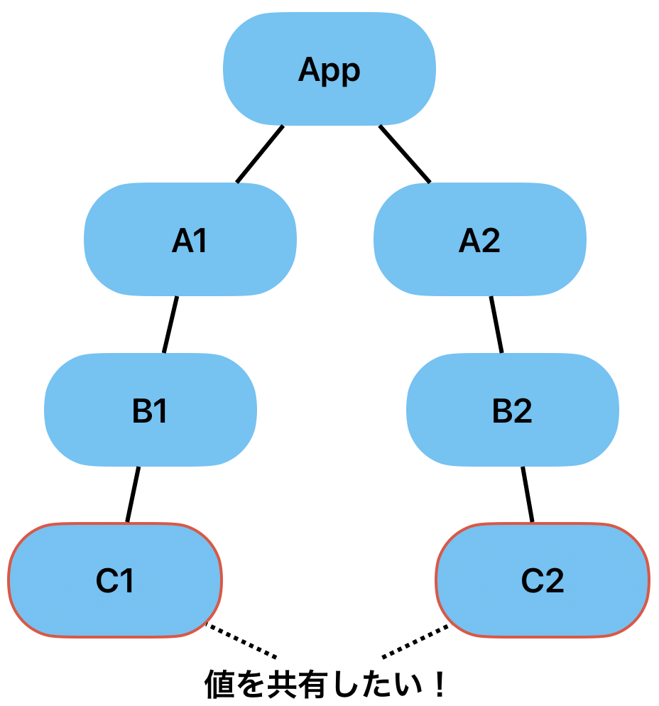
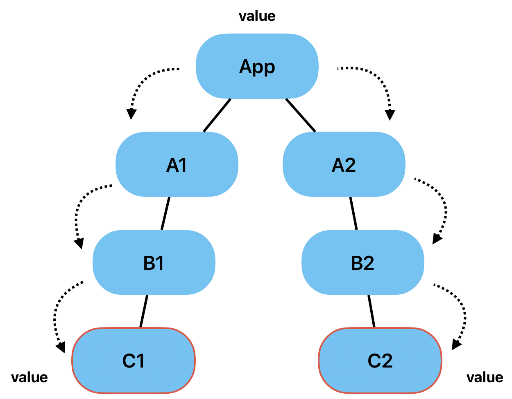
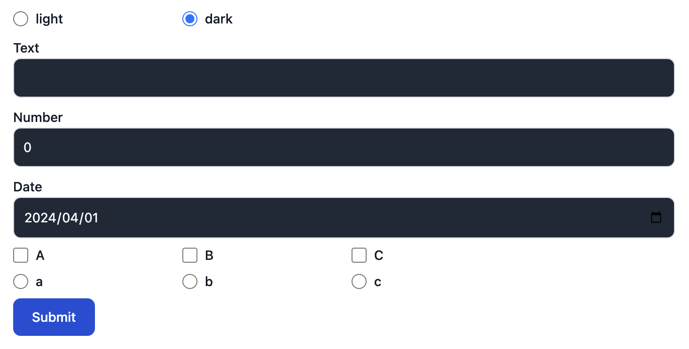

<!-- omit in toc -->
# 状態管理 その他の状態管理 useReducer, useContext

<!-- omit in toc -->
## 目次
- [useReducerの使い方](#usereducerの使い方)
  - [useReducerの利点](#usereducerの利点)
- [useReducer演習](#usereducer演習)
  - [コンポーネントの準備](#コンポーネントの準備)
  - [解答例](#解答例)
- [グローバルな状態管理useContext](#グローバルな状態管理usecontext)
  - [グローバルな状態管理(useContext)の目的](#グローバルな状態管理usecontextの目的)
  - [useContextの使い方](#usecontextの使い方)
  - [useContextのファイル分け](#usecontextのファイル分け)
- [Next: Chapter6 useEffect](#next-chapter6-useeffect)
- [Prev: Chapter4 状態管理　useState](#prev-chapter4-状態管理usestate)


## useReducerの使い方
useReducerもuseStateと同じように、状態管理を行うものです。状態更新の方法が異なります。簡単にuseReducerの使い方を見ていきましょう。

```javascript
import { useReducer } from 'react';

const reducer = (state, action) => {
  // ...
};

const MyComponent = () => {
  const [state, dispatch] = useReducer(reducer, { age: 42 });
  // ...
};
```

`useReducer`の引数と返値は、以下のとおりです。

`useReducer`の引数
- `reducer`:更新用の関数
- `initialState`:状態の初期値（上記の例だと`{ age: 42 }`）

`useReducer`の返値
- `state`:現在の状態
- `dispatch`:state更新用の関数

`useReducer`は、`reducer`を指定しているということと、`state`更新用の`dispatch`があるという点で、`useState`と異なります。

まずは、`reducer`をどのように指定するかを見ていきましょう。

`reducer`は、2つの引数を受け取ります。
- `state`:現在の状態
- `action`:`dispatch`に渡されたオブジェクト

`action`には、Reactの慣習的に以下のようなプロパティを持ちます。
```javascript
interface Action {
  type: string;
  payload: any;
}
```

`reducer`では、`action.type`に応じて、状態の変更を行います。また、状態の変更に必要な値やオブジェクトがある場合、`payload`にそれを指定します。

```javascript
const reducer = (state, action) => {
  switch (action.type) {
    case "increment_age":
      return { ...state, age: state.age + 1 };
    case "change_age":
      return { ...state, age: action.payload };
    default:
      throw Error("Unknown action.");
  }
};
```

上記のような`reducer`を指定した場合、`dispatch`は以下のように使用します。

```javascript
const MyComponent = () => {
  const [state, dispatch] = useReducer(reducer, { age: 42 });
  // ageを+1する場合
  dispatch({ type: "increment_age" });
  // ageを新しい値に変更する場合
  dispatch({ type: "change_age", payload: 30 });
  // ...
};
```

この資料では、typescriptも使用するので、型も定義しましょう。`useReducer`を利用する場合、`state`と`action`の型の定義が必要です。この例の場合、以下のように定義します。

```javascript
type Action =
  | {
      type: "increment_age";
    }
  | { type: "change_age"; payload: number };

interface State {
  age: number;
}

const reducer = (state: State, action: Action) => {
  // ...
};
```

### useReducerの利点
`useReducer`が`useState`と比べて良いところは、以下のとおりです。どれも保守性に関わるもので、大規模な開発や、さまざまなコンポーネントで使用される状態の管理に使うと良さそうです。

1. **更新の方法を、限定できる**：
  `useReducer`は、`reducer`で定義された方法でしか状態の更新ができません。そのため、勝手に書き換えられたくないプロパティがある場合や、他のプロパティから自動的に計算されるプロパティなどがある場合に、勝手な書き換えや更新のし忘れを防ぐことができます。

2. **更新用の関数は、`dispatch`のみ**：
  1の利点は、`useState`でも更新用の関数を1つ1つ定義すれば、実現できます。ただ、子コンポーネントに大量の更新用の関数を渡すと`props`が煩雑になってしまい、可読性が落ちてしまいます。`useReducer`であれば、更新用の関数は、`dispatch`のみなので、子コンポーネントにも`dispatch`を渡すだけで十分です。

3. **`reducer`は、純粋関数**：
  `reducer`は、`state`に依存せず純粋な関数として定義ができます。そのため、`reducer`の単体テストを書くことができます。

## useReducer演習
それでは、前の章で作成したフォームを今回は、`useReducer`を使って実装しましょう。

### コンポーネントの準備
まずは、基本となるコンポーネントを準備します。この内容は、前の章の`useState`の演習と同じです。

`MyFormReducer`コンポーネントをつくります。

`src/components/MyFormReducer.tsx`
```javascript
import { useReducer } from "react";
import LabeledInput from "./LabeledInput";
import LabeledSelectInput from "./LabeledSelectInput";

type Action = { type: string };

interface State {
  text: string;
  number: number;
  date: Date;
  check: string[];
  radio: string;
}

const reducer = (state: State, action: Action) => {
  // ...
  return state;
};

const MyFormReducer = () => {
  const [state, dispatch] = useReducer(reducer, {
    text: "",
    number: 0,
    date: new Date(),
    check: [],
    radio: "",
  });
  const handleSubmit = (e: React.FormEvent<HTMLFormElement>) => {
    // submitはデフォルトで再読み込みするようになっているので、
    // それを行わないようにする。
    e.preventDefault();
    console.log(state);
  };
  return (
    <form className="mx-auto w-1/2 space-y-2" onSubmit={handleSubmit}>
      <LabeledInput label="Text" type="text" />
      <LabeledInput label="Number" type="number" />
      <LabeledInput label="Date" type="date" />
      <div className="grid grid-cols-4 gap-4">
        {["A", "B", "C"].map((value) => (
          <LabeledSelectInput
            key={value}
            type="checkbox"
            label={value}
            value={value}
          />
        ))}
      </div>
      <div className="grid grid-cols-4 gap-4">
        {["a", "b", "c"].map((value) => (
          <LabeledSelectInput
            key={value}
            type="radio"
            label={value}
            value={value}
          />
        ))}
      </div>
      <button
        type="submit"
        className="mb-2 me-2 rounded-lg bg-blue-700 px-5 py-2.5 text-sm font-medium text-white hover:bg-blue-800 focus:outline-none focus:ring-4 focus:ring-blue-300"
      >
        Submit
      </button>
    </form>
  );
};

export default MyFormReducer;
```

`App.tsx`に`MyFormReducer`を追加しましょう。

`src/App.tsx`
```javascript
import MyFormReducer from "./components/MyFormReducer";

function App() {
  return (
    <div className="m-4 space-y-2">
      <MyFormReducer />
    </div>
  );
}

export default App;
```

**注意点**：今回は、`state.date`の型は`Date`オブジェクトに、`state.number`の型は`number`になっています。`input`要素の`type="date"`となっているところの`value`は、`string`で`YYYY-MM-DD`の形式にしてください。

### 解答例
以下に解答例を示します。他の実装方法もたくさんあります。

```javascript
import { useReducer } from "react";
import LabeledInput from "./LabeledInput";
import LabeledSelectInput from "./LabeledSelectInput";

type Action =
  | { type: "changeText"; payload: string }
  | { type: "changeNumber"; payload: string }
  | { type: "changeDate"; payload: string }
  | { type: "changeCheck"; payload: string }
  | { type: "changeRadio"; payload: string };

interface State {
  text: string;
  number: number;
  date: Date;
  check: string[];
  radio: string;
}

const reducer = (state: State, { type, payload }: Action): State => {
  switch (type) {
    case "changeText":
      return { ...state, text: payload };
    case "changeNumber":
      return { ...state, number: parseInt(payload) };
    case "changeDate":
      return { ...state, date: new Date(payload) };
    case "changeCheck":
      if (state.check.includes(payload)) {
        return { ...state, check: state.check.filter((v) => v !== payload) };
      } else {
        return { ...state, check: [...state.check, payload] };
      }
    case "changeRadio":
      return { ...state, radio: payload };
    default:
      throw Error("Unknown action type");
  }
};

const MyFormReducer = () => {
  const [state, dispatch] = useReducer(reducer, {
    text: "",
    number: 0,
    date: new Date(),
    check: [],
    radio: "",
  });
  const handleSubmit = (e: React.FormEvent<HTMLFormElement>) => {
    // submitはデフォルトで再読み込みするようになっているので、
    // それを行わないようにする。
    e.preventDefault();
    console.log(state);
  };
  return (
    <form className="mx-auto w-1/2 space-y-2" onSubmit={handleSubmit}>
      <LabeledInput
        label="Text"
        type="text"
        value={state.text}
        onChange={(e) => {
          dispatch({ type: "changeText", payload: e.target.value });
        }}
      />
      <LabeledInput
        label="Number"
        type="number"
        value={state.number}
        onChange={(e) => {
          dispatch({ type: "changeNumber", payload: e.target.value });
        }}
      />
      <LabeledInput
        label="Date"
        type="date"
        value={state.date.toISOString().split("T")[0]}
        onChange={(e) => {
          dispatch({ type: "changeDate", payload: e.target.value });
        }}
      />
      <div className="grid grid-cols-4 gap-4">
        {["A", "B", "C"].map((value) => (
          <LabeledSelectInput
            key={value}
            type="checkbox"
            label={value}
            value={value}
            checked={state.check.includes(value)}
            onChange={(e) => {
              dispatch({ type: "changeCheck", payload: e.target.value });
            }}
          />
        ))}
      </div>
      <div className="grid grid-cols-4 gap-4">
        {["a", "b", "c"].map((value) => (
          <LabeledSelectInput
            key={value}
            type="radio"
            label={value}
            value={value}
            checked={state.radio === value}
            onChange={(e) => {
              dispatch({ type: "changeRadio", payload: e.target.value });
            }}
          />
        ))}
      </div>
      <button
        type="submit"
        className="mb-2 me-2 rounded-lg bg-blue-700 px-5 py-2.5 text-sm font-medium text-white hover:bg-blue-800 focus:outline-none focus:ring-4 focus:ring-blue-300"
      >
        Submit
      </button>
    </form>
  );
};

export default MyFormReducer;
```


## グローバルな状態管理useContext
ここでは、グローバルな状態管理の方法`useContext`について説明します。ただし、グローバルな状態管理には、`redux`や`zustand`などの有名なライブラリがあり、こちらを使う方が、パフォーマンス面で良いとされています。そのため、実務ではライブラリを使った方が良いでしょう。

知識として、reactにもグローバルな状態管理ができる`useContext`があるということを覚えておいてください。

### グローバルな状態管理(useContext)の目的
Reactでは、コンポーネント間の状態の共有は、`props`を利用します。子コンポーネント同士で状態を共有したい場合、その状態は、親コンポーネントが持つ必要があります。もっと深い子コンポーネント同士で、状態を共有したい場合も同様で、かなり上位のコンポーネントが状態を持つ必要があります。その時中間のコンポーネントは、状態をただ受け渡すだけの`props`が存在することになり、必然的に中間コンポーネントの`props`が煩雑になります。

コンポーネントをツリーとして考えてみましょう。(参考：[UI をツリーとして理解する](https://ja.react.dev/learn/understanding-your-ui-as-a-tree))
以下は、`App`コンポーネントから`A1`, `A2`コンポーネントを呼び出し、`A1`, `A2`はそれぞれ`B1`, `B2`を呼び出し、`B1`, `B2`は、`C1`, `C2`を呼び出している図です。



ここで、`C1`, `C2`コンポーネントが、値を共有したい場合、`App`コンポーネントがその共有する値を持ち、下に渡していく必要があります。



この時、`C1`, `C2`以外のコンポーネントは、ただ`value`を下に受け渡すだけになります。これが複数の値になってくると中間のコンポーネントは、下に渡すだけの`props`が多くなり、煩雑になっていきます。

これを防ぐために、グローバルな状態管理を行い、不要な`props`の受け渡しを解消していきます。

### useContextの使い方
それでは、使い方を見ていきます。

`App`コンポーネントで`theme`という値を持ち、`MyFormReducer`コンポーネント内の`LabeledInput`が`theme`の値によって、スタイルを変えるようにしましょう。

まず、`App`コンポーネント内に`theme`という値を保持しましょう。

`src/App.tsx`
```javascript
import { useState } from "react";
import MyFormReducer from "./components/MyFormReducer";

function App() {
  const [theme, setTheme] = useState("light");
  return (
    <div className="m-4 space-y-2">
      <MyFormReducer />
    </div>
  );
}

export default App;
```

`App`に保持している`theme`と`setTheme`を`useContext`を使って、各コンポーネントに共有していきます。
まず、`App.tsx`に以下を追加します。（`App`コンポーネントの外に記述してください。）

```javascript
import { createContext, useState } from "react";
import MyFormReducer from "./components/MyFormReducer";

export const ThemeContext = createContext<{
  theme: string;
  setTheme: React.Dispatch<React.SetStateAction<string>>;
}>({ theme: "", setTheme: () => {} });

function App() {
  // ...
}
```

`createContext`の引数には、共有する状態の初期値を渡してください。この`ThemeContext`を使って`App`コンポーネントを以下のように書き換えます。
`App`コンポーネントの返値を、`ThemeContext.Provider`コンポーネントで囲い、グローバルに共有したい値を`ThemeContext.Provider`コンポーネントの`value`に指定します。

```javascript
function App() {
  const [theme, setTheme] = useState("light");
  return (
    <ThemeContext.Provider value={{ theme, setTheme }}>
      <div className="m-4 space-y-2">
        <MyFormReducer />
      </div>
    </ThemeContext.Provider>
  );
}
```

これで、`theme`と`setTheme`を共有する準備が整いました。`ThemeContext.Provider`コンポーネントで囲ったことで、`value`propsの値を`useContext`を使って参照することができます。

それでは、グローバルに共有されている値を、`LabeledInput`コンポーネントで読み取って見ましょう。`LabeledInput`を以下のように書き換えましょう。

`src/components/LabeledInput.tsx`
```javascript
import { useContext } from "react";
import { ThemeContext } from "../App";

interface LabeledInputProps
  extends React.InputHTMLAttributes<HTMLInputElement> {
  label: string;
}

const LabeledInput: React.FC<LabeledInputProps> = ({ label, ...props }) => {
  const { theme } = useContext(ThemeContext);
  console.log(theme);
  return (
    <div>
      <label className="mb-2 text-sm font-medium text-gray-900">{label}</label>
      <input
        className="w-full rounded-lg border border-gray-300 bg-gray-50 p-2.5 text-sm text-gray-900 focus:border-blue-500 focus:ring-blue-500"
        {...props}
      />
    </div>
  );
};

export default LabeledInput;
```

`LabeledInput`内で、`theme`の値を参照し、コンソールに表示させました。`npm run dev`を実行し、ブラウザでコンソールを確認してみましょう。`MyFormReducer`コンポーネント内で、`LabeledInput`コンポーネントは、３つ使われており、React.StrictModeが有効なので、3×2回`light`とコンソールに表示されるはずです。

これでpropsで渡さなくても、`useContext`を使って値を参照できました。この方法で、グローバルな状態管理ができます。１つ注意点として、`ThemeContext.Provider`コンポーネントで囲った範囲でしか値を共有することができません。そのため、`Provider`コンポーネントは、値を共有したい範囲の最上位のコンポーネントで使うようにしてください。

それでは、`LabeledInput`が`theme`によってスタイルが変わるようにしましょう。それぞれのコンポーネントを以下のように書き換えてください。

`src/components/LabeledInput.tsx`
```javascript
import { useContext } from "react";
import { ThemeContext } from "../App";

interface LabeledInputProps
  extends React.InputHTMLAttributes<HTMLInputElement> {
  label: string;
}

const LabeledInput: React.FC<LabeledInputProps> = ({ label, ...props }) => {
  const { theme } = useContext(ThemeContext);

  const className =
    theme === "dark"
      ? "w-full rounded-lg border border-gray-300 bg-gray-800 p-2.5 text-sm text-gray-50 focus:border-blue-600 focus:ring-blue-600"
      : "w-full rounded-lg border border-gray-300 bg-gray-50 p-2.5 text-sm text-gray-900 focus:border-blue-500 focus:ring-blue-500";
  return (
    <div>
      <label className="mb-2 text-sm font-medium text-gray-900">{label}</label>
      <input className={className} {...props} />
    </div>
  );
};

export default LabeledInput;
```

さらに`theme`を切り替えるボタンを用意しましょう。新たに`ThemeSwitch`コンポーネントを用意し、`useContext`を使って`setTheme`を参照し、`teheme`の値を制御しましょう。以下のファイル作成してください。

`src/components/ThemeSwitch.tsx`
```javascript
import { useContext } from "react";
import LabeledSelectInput from "./LabeledSelectInput";
import { ThemeContext } from "../App";

const ThemeSwitch: React.FC = () => {
  const { theme, setTheme } = useContext(ThemeContext);
  return (
    <div className="mx-auto grid w-1/2 grid-cols-4 gap-4">
      {["light", "dark"].map((value) => (
        <LabeledSelectInput
          key={value}
          type="radio"
          label={value}
          value={value}
          checked={theme === value}
          onChange={(e) => {
            setTheme(e.target.value);
          }}
        />
      ))}
    </div>
  );
};

export default ThemeSwitch;
```

このコンポーネントを利用することで、`theme`の値を変更できます。このコンポーネントを`App`に追加しましょう。`App.tsx`を以下のように変更します。

`srx/App.tsx`
```javascript
import { createContext, useState } from "react";
import MyFormReducer from "./components/MyFormReducer";
import ThemeSwitch from "./components/ThemeSwitch";

export const ThemeContext = createContext<{
  theme: string;
  setTheme: React.Dispatch<React.SetStateAction<string>>;
}>({ theme: "", setTheme: () => {} });

function App() {
  const [theme, setTheme] = useState("dark");
  return (
    <ThemeContext.Provider value={{ theme, setTheme }}>
      <div className="m-4 space-y-2">
        <ThemeSwitch />
        <MyFormReducer />
      </div>
    </ThemeContext.Provider>
  );
}

export default App;
```

`npm run dev`を実行し、結果をブラウザで確認しましょう。上のラジオボタンで`theme`を変更し、`LabeledInput`のスタイルを変更することができれば、成功です。




### useContextのファイル分け
`useContext`を使ったグローバルな状態管理では、状態を受け渡す`Provider`コンポーネントは、別ファイルで管理されることが多いです。目的としては、グローバルな状態を他のコンポーネントから分離するためと、グローバルな状態を扱うコンポーネントでの記述がより簡潔になるようにするためです。

ここでは、ファイル分けの一例を紹介します。

それでは、`App`コンポーネントで使ったグローバルな状態管理に関わるものを別ファイルに移していきます。
`useContext`をつかった状態管理では、`src/context`ディレクトリ配下で行います。以下のファイルを作成してください。

`src/context/ThemeContext.tsx`
```javascript
import { createContext, useContext, useState } from "react";

const ThemeContext = createContext<{
  theme: string;
  setTheme: React.Dispatch<React.SetStateAction<string>>;
}>({ theme: "", setTheme: () => {} });

interface ThemeProviderProps {
  children: React.ReactNode;
}

export const ThemeProvider: React.FC<ThemeProviderProps> = ({ children }) => {
  const [theme, setTheme] = useState("light");
  return (
    <ThemeContext.Provider value={{ theme, setTheme }}>
      {children}
    </ThemeContext.Provider>
  );
};

export const useTheme = () => useContext(ThemeContext);
```

`ThemeContext`は、`App.tsx`から移動させただけです。
`ThemeProvider`コンポーネントは、`useState`で状態を保持し、`ThemeContext.Provider`コンポーネントをつかって`children`を囲みます。これによって、状態管理は、このコンポーネントに移り、`theme`に関する状態管理を`App`から分離できます。

また、状態を参照する場合、`useContext(ThemeContext)`としても良いですが、`useContext`と`ThemeContext`の2つインポートする必要があるので、1つで済むように、`useTheme`を用意しました。

それでは、これらを使って他のコンポーネントを書き換えていきます。

まず、`App`コンポーネントは、`ThemeProvider`を使うと以下のようになります。

```javascript
import MyFormReducer from "./components/MyFormReducer";
import ThemeSwitch from "./components/ThemeSwitch";
import { ThemeProvider } from "./context/ThemeContext";

function App() {
  return (
    <ThemeProvider>
      <div className="m-4 space-y-2">
        <ThemeSwitch />
        <MyFormReducer />
      </div>
    </ThemeProvider>
  );
}

export default App;
```

`theme`や`setTheme`を参照している`LabeledInput`、`ThemeSwitch`は、`useTheme`を使って以下のようになります。

`src/components/LabeledInput.tsx`
```javascript
import { useTheme } from "../context/ThemeContext";

interface LabeledInputProps
  extends React.InputHTMLAttributes<HTMLInputElement> {
  label: string;
}

const LabeledInput: React.FC<LabeledInputProps> = ({ label, ...props }) => {
  const { theme } = useTheme();

  const className =
    theme === "dark"
      ? "w-full rounded-lg border border-gray-300 bg-gray-800 p-2.5 text-sm text-gray-50 focus:border-blue-600 focus:ring-blue-600"
      : "w-full rounded-lg border border-gray-300 bg-gray-50 p-2.5 text-sm text-gray-900 focus:border-blue-500 focus:ring-blue-500";
  return (
    <div>
      <label className="mb-2 text-sm font-medium text-gray-900">{label}</label>
      <input className={className} {...props} />
    </div>
  );
};

export default LabeledInput;
```

`src/components/ThemeSwitch.tsx`
```javascript
import { useTheme } from "../context/ThemeContext";
import LabeledSelectInput from "./LabeledSelectInput";

const ThemeSwitch: React.FC = () => {
  const { theme, setTheme } = useTheme();
  return (
    <div className="mx-auto grid w-1/2 grid-cols-4 gap-4">
      {["light", "dark"].map((value) => (
        <LabeledSelectInput
          key={value}
          type="radio"
          label={value}
          value={value}
          checked={theme === value}
          onChange={(e) => {
            setTheme(e.target.value);
          }}
        />
      ))}
    </div>
  );
};

export default ThemeSwitch;
```

これで、これまでと全く同じ制御ができるはずです。`npm run dev`を実行し、結果をブラウザで確認してみてください。

## [Next: Chapter6 useEffect](../chapters/chapter6.md)

## [Prev: Chapter4 状態管理　useState](../chapters/chapter4.md)