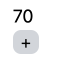
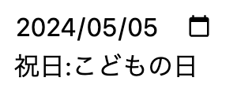
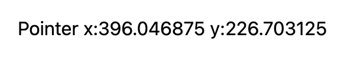
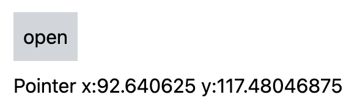
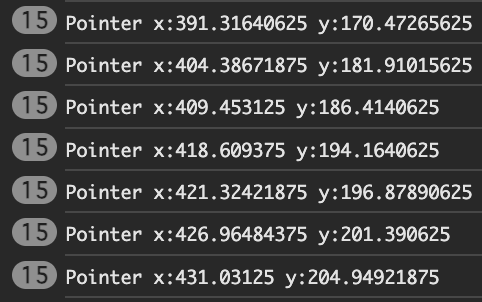

<!--  -->

<!-- omit in toc -->
# useEffect

<!-- omit in toc -->
## 目次
- [関数コンポーネントの処理による制限](#関数コンポーネントの処理による制限)
- [useEffectとは](#useeffectとは)
- [useEffectの具体的な用途](#useeffectの具体的な用途)
  - [データフェッチ](#データフェッチ)
  - [イベントの登録](#イベントの登録)
    - [クリーアップ関数の役割](#クリーアップ関数の役割)
- [useLayoutEffect](#uselayouteffect)
  - [useLayoutEffectの注意点](#uselayouteffectの注意点)
- [Next: Chapter7 DOM操作 useRef, Portal](#next-chapter7-dom操作-useref-portal)
- [Prev: Chapter5 その他の状態管理 useReducer, useContext](#prev-chapter5-その他の状態管理-usereducer-usecontext)

## 関数コンポーネントの処理による制限
一度だけ実行したい内容がある場合、コンポーネントの先頭に処理を書くと、コンポーネントが再描画される度に実行されてしまいます。

少し例を見てみましょう。以前作成した`Counter`コンポーネントに2秒後に`count`を10増やすという処理を加えます。以下のように修正してください。

`src/components/Counter.tsx`
```jsx
import { useState } from "react";

const Counter: React.FC = () => {
  const [count, setCount] = useState(0);

  setTimeout(() => {
    setCount((prev) => prev + 10);
  }, 2000);

  return (
    <div>
      <div className="text-lg">{count}</div>
      <button
        className="rounded-lg bg-gray-300 px-2"
        onClick={() => {
          setCount((prev) => prev + 1);
        }}
      >
        +
      </button>
    </div>
  );
};

export default Counter;
```

結果を確認するために、`App`コンポーネントを以下のように書き換えます。

`src/App.tsx`
```jsx
import Counter from "./components/Counter";

function App() {
  return (
    <div className="m-4 space-y-2">
      <Counter />
    </div>
  );
}

export default App;
```

`npm run dev`を実行して、ブラウザで結果を見てましょう。



まず、`StrictMode`が有効なので、コンポーネントが2回実行されます。その関係で、何も触らなくても2秒ごとに20ずつ増加します。

さらに+ボタンを何度かクリックしてみてください。そうすると、どんどん増加する値が増えていくかと思います。

これは、`counter`の値が更新される度に`Counter`コンポーネントが再実行されるので、その度に`setTimeout`が実行されることが原因です。

一度だけ実行したい場合、`useEffect`を利用することで実現できます。`useEffect`の使い方を見ていきましょう。

## useEffectとは
関数コンポーネントで一度だけ実行したい処理がある場合や、何らかの値に合わせて変更される別の値がある場合などに使用します。

`useEffect`は以下のように記述します。

```jsx
import { useEffect } from "react";

const MyComponent: React.FC = () => {
  useEffect(
    () => {
      // 処理を記述
      // ...

      // 返値には、クリーアップ関数を指定。
      return () => {};
    },
    [
      /* 依存する変数を入れる */
    ],
  );
  return <></>;
};
```

`useEffect`の第一引数には、関数を指定します。関数の中に行いたい処理を記述します。関数の返値には、クリーンアップ関数を記述します。クリーンアップ関数はこのコンポーネントがアンマウント(DOMから消える)時に実行されます。

第二引数には、配列を指定します。配列には、依存している変数を入れます。依存している変数が変更されるたびに、`useEffect`に指定した関数の中身が実行されます。空の配列を指定した場合、マウント(DOMに出現する)時に1度だけ実行されます。

[関数コンポーネントの処理による制限](#関数コンポーネントの処理による制限)で作成した`Counter`コンポーネントを`useEffect`を使って`setTimeout`の処理を1度だけ実行するようにしましょう。`Counter`コンポーネントを以下のように変更します。

`src/components/Counter.tsx`
```jsx
import { useEffect, useState } from "react";

const Counter: React.FC = () => {
  const [count, setCount] = useState(0);

  useEffect(() => {
    setTimeout(() => {
      setCount((prev) => prev + 10);
    }, 1000);
  }, []);

  return (
    <div>
      <div className="text-lg">{count}</div>
      <button
        className="rounded-lg bg-gray-300 px-2"
        onClick={() => {
          setCount((prev) => prev + 1);
        }}
      >
        +
      </button>
    </div>
  );
};

export default Counter;
```

1度だけ実行するので、`useEffect`の第二引数は空の配列を指定します。

`npm run dev`を実行し、ブラウザで結果を見てみましょう。`StrictMode`が有効なため、2秒後にカウントは20増えますが、それ以降は増えないはずです。


## useEffectの具体的な用途


### データフェッチ
APIから取得した値によって、画面の表示や選択肢が変わることは、よくあることです。しかし大抵の場合、APIからのデータ取得は、再描画ごとに行う必要はありません。そこで`useEffect`が利用されます。

実際に、[国民の祝日API](https://national-holidays.jp/about.html)を利用して、入力された日付の祝日の名前を取得するコンポーネントを作ってみましょう。

```jsx
import { useEffect, useState } from "react";

const Holiday: React.FC = () => {
  const [date, setDate] = useState("");
  const [name, setName] = useState("");

  const fetchHoliday = async (date: string) => {
    const response = await fetch(`http://api.national-holidays.jp/${date}`);
    const data = await response.json();
    setName(data.name ?? "該当なし");
  };

  useEffect(() => {
    const parsedDate = new Date(date);
    // Dateがparseできた場合のみ処理を行う
    if (!Number.isNaN(parsedDate.getTime())) {
      fetchHoliday(date);
    }
  }, [date]);

  return (
    <div>
      <input
        type="date"
        value={date}
        onChange={(e) => {
          setDate(e.target.value);
        }}
      />
      <div>祝日:{name}</div>
    </div>
  );
};

export default Holiday;
```

このコンポーネントでは、`useEffect`の第二引数の配列には、`date`を指定しています。そのため、`date`を変更するたびに`useEffect`で指定した関数が実行され、祝日の名前を取得します。

`App`コンポーネントに追加して実行結果を確認してみてください。

```jsx
import Holiday from "./components/Holiday";

function App() {
  return (
    <div className="m-4 space-y-2">
      <Holiday />
    </div>
  );
}

export default App;
```



### イベントの登録
windowにイベントを紐付けたい場合にも使われます。windowにイベントを紐付けた場合、この関数がアンマウントされた後でも動作し続けてしまうので、クリーアップ関数も定義します。

少し例を見てみましょう。windowのpointermoveイベントに紐づけて、ポインターの座標を表示するコンポーネントを作ります。以下のファイルを作成してください。

`src/components/PointerPosition.tsx`
```jsx
import { useEffect, useState } from "react";

const PointerPosition: React.FC = () => {
  const [position, setPosition] = useState({ x: 0, y: 0 });

  const handlePointerMove = (event: PointerEvent) => {
    setPosition({ x: event.clientX, y: event.clientY });
  };

  useEffect(() => {
    window.addEventListener("pointermove", handlePointerMove);
    return () => {
      window.removeEventListener("pointermove", handlePointerMove);
    };
  }, []);

  return <div>{`Pointer x:${position.x} y:${position.y}`}</div>;
};

export default PointerPosition;
```

`App`コンポーネントに追加して実行結果を確認してみてください。

`src/App.tsx`
```jsx
import PointerPosition from "./components/PointerPosition";

function App() {
  return (
    <div className="m-4 space-y-2">
      <PointerPosition />
    </div>
  );
}

export default App;
```



#### クリーアップ関数の役割
ここでクリーアップ関数の役割を見てみましょう。`PointerPosition`コンポーネントを以下のように変更してください。

```jsx
import { useEffect, useState } from "react";

const PointerPosition: React.FC = () => {
  const [position, setPosition] = useState({ x: 0, y: 0 });

  const handlePointerMove = (event: PointerEvent) => {
    setPosition({ x: event.clientX, y: event.clientY });
    console.log(`Pointer x:${event.clientX} y:${event.clientY}`);
  };

  useEffect(() => {
    window.addEventListener("pointermove", handlePointerMove);
  }, []);

  return <div>{`Pointer x:${position.x} y:${position.y}`}</div>;
};

export default PointerPosition;
```

`useEffect`からクリーアップ関数を除きました。また、`handlePointerMove`に`console.log`でポインターの位置を表示するようにしました。

次は、`PointerPosition`コンポーネントがマウント・アンマウントされるように`App.tsx`を以下のように変更します。

```jsx
import { useState } from "react";
import PointerPosition from "./components/PointerPosition";

function App() {
  const [isOpen, setIsOpen] = useState(true);
  return (
    <div className="m-4 space-y-2">
      <button
        className="bg-gray-300 p-2"
        onClick={() => {
          setIsOpen((prev) => !prev);
        }}
      >
        open
      </button>
      {isOpen && <PointerPosition />}
    </div>
  );
}

export default App;
```

こうすることで、`isOpen`が`true`のときに`PointerPosition`コンポーネントがマウントされるようになりました。`isOpen`は`open`ボタンを押すと`true`, `false`が切り替わります。

これで実行結果を確認してみましょう。



コンソールを表示して、openボタンを何度か押してみてください。ボタンを押す度にコンソールに表示される数が増えていきます。



これは、`PointerPosition`コンポーネントがマウントされる度に、windowにイベントハンドラが紐づけられるため、マウントされた回数だけコンソールに表示されてしまいます。（正確には、`StrictMode`で余分に実行されているものもあります。）

それでは、`PointerPosition`コンポーネントの`useEffect`にクリーンアップ関数を戻しましょう。以下のように変更してください。

`PointerPosition`コンポーネントの`useEffect`
```jsx
useEffect(() => {
  window.addEventListener("pointermove", handlePointerMove);
  return () => {
    window.removeEventListener("pointermove", handlePointerMove);
  };
}, []);
```

これで、`PointerPosition`コンポーネントがアンマウントされた時に、クリーアップ関数が実行され、イベントがwindowから除かれるので、先ほどのような現象は起きず、1度だけコンソールに表示されるようになります。


## useLayoutEffect
Reactには、`useEffect`と非常によく似た`useLayoutEffect`というものがあります。使い方は、`useEffect`と同じですが、動作が微妙に異なります。ここでは、`useLayoutEffect`が`useEffect`とどのように違うのかをみていきます。

簡単に説明すると`useEffect`は、非同期的に実行されますが、`useLayoutEffect`は同期的に実行されます。

具体的に動作を見ていきましょう。`Counter`コンポーネントで、`useEffect`でカウントが10以上になったら0にリセットするという動作を入れてみましょう。`Counter`コンポーネントを以下のように修正してください。

`src/components/Counter.tsx`
```jsx
import { useEffect, useState } from "react";

const Counter: React.FC = () => {
  const [count, setCount] = useState(0);

  useEffect(() => {
    if (count >= 10) setCount(0);
  }, [count]);

  return (
    <div>
      <div className="text-lg">{count}</div>
      <button
        className="rounded-lg bg-gray-300 px-2"
        onClick={() => {
          setCount((prev) => prev + 1);
        }}
      >
        +
      </button>
    </div>
  );
};

export default Counter;
```

それでは、`App`コンポーネントに`Counter`コンポーネントを追加し、動作を見てみましょう。

`src/App.tsx`
```jsx
import Counter from "./components/Counter";

function App() {
  return (
    <div className="m-4 space-y-2">
      <Counter />
    </div>
  );
}

export default App;
```

+ボタンをクリックしてカウントを進めてみてください。一瞬だけ10になるタイミングがあるかと思います(実行環境によってはならない場合もあります)。これは、`useEffect`の処理が非同期で行われており、カウントが10になった時も、描画が先に行われ、10になった瞬間が見えてしまいます。

それでは、`useEffect`を`useLayoutEffect`に変えてみましょう。

`src/components/Counter.tsx`
```jsx
import { useLayoutEffect, useState } from "react";

const Counter: React.FC = () => {
  const [count, setCount] = useState(0);

  useLayoutEffect(() => {
    if (count >= 10) setCount(0);
  }, [count]);

  return (
    <div>
      <div className="text-lg">{count}</div>
      <button
        className="rounded-lg bg-gray-300 px-2"
        onClick={() => {
          setCount((prev) => prev + 1);
        }}
      >
        +
      </button>
    </div>
  );
};

export default Counter;
```

これで実行してみると、10になる瞬間は見えません。これは、`useLayoutEffect`が同期的に動作しており、描画を行う前に、`useLayoutEffect`の処理を行っているためです。

### useLayoutEffectの注意点
公式の[useLayoutEffectのドキュメント](https://ja.react.dev/reference/react/useLayoutEffect)にもありますが、`useLayoutEffect`はパフォーマンスを低下させる可能性があります。可能な限り`useEffect`を使用することを推奨します。

## [Next: Chapter7 DOM操作 useRef, Portal](../chapters/chapter7.md)

## [Prev: Chapter5 その他の状態管理 useReducer, useContext](../chapters/chapter5.md)

<!--  -->