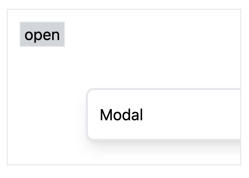
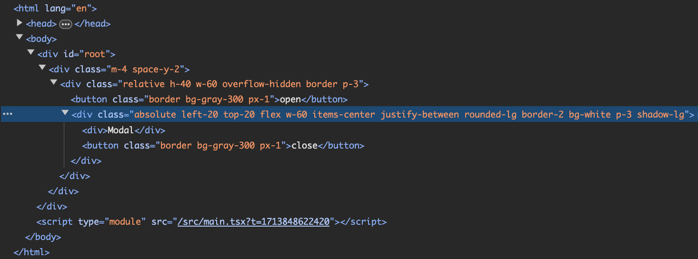
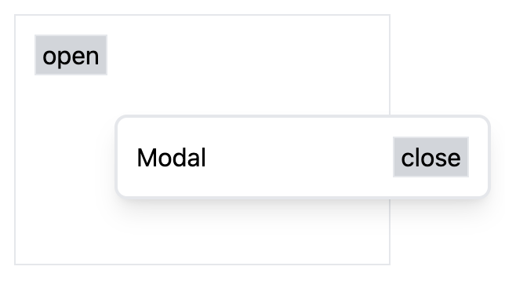
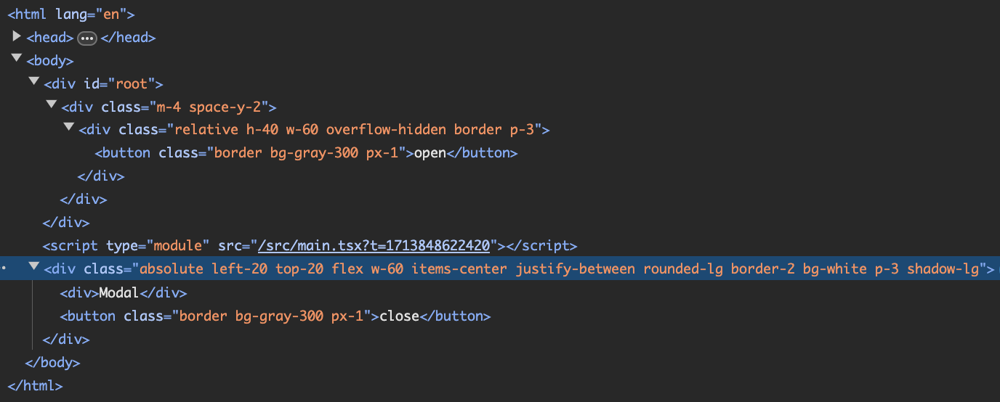

<!--  -->

<!-- omit in toc -->
# DOM操作　useRef, createPortal

<!-- omit in toc -->
## 目次
- [DOM操作](#dom操作)
- [useRef](#useref)
  - [準備](#準備)
  - [使い方](#使い方)
    - [フォーカスを当てる](#フォーカスを当てる)
    - [要素へのスクロール](#要素へのスクロール)
    - [動画の再生・停止](#動画の再生停止)
  - [付録：useRefで値を保存する](#付録userefで値を保存する)
- [createPortal](#createportal)
  - [createPortalの引数](#createportalの引数)
- [Next: Chapter8 カスタムフック](#next-chapter8-カスタムフック)
- [Prev: Chapter6 useEffect](#prev-chapter6-useeffect)


## DOM操作
Reactでは、自動的にDOMを更新するので、基本的にDOM操作をする必要はありません。

ただし、以下の動作などはReactから直接DOM操作を行う必要があります。
- フォーカスを当てる
- 要素へのスクロール
- ビデオの再生と一時停止
- DOMの位置を手動で設定

## useRef
以下の操作は、`useRef`を使うことで実装できます。
- フォーカスを当てる
- 要素へのスクロール
- ビデオの再生と一時停止

### 準備

まず、`useRef`の使い方を見ていくコンポーネントを作っていきましょう。以下のファイルを作成します。

`src/components/ControlDOM.tsx`
```jsx
const ControlDOM: React.FC = () => {
  return <></>;
};

export default ControlDOM;
```

結果を確認するために、`App`コンポーネントを以下のように修正しましょう。

`src/App.tsx`
```jsx
import ControlDOM from "./components/ControlDOM";

function App() {
  return (
    <div className="m-4 space-y-2">
      <ControlDOM />
    </div>
  );
}

export default App;
```

### 使い方
それでは、`useRef`の使い方を見ていきましょう。

`useRef`は以下のようにDOM操作を行いたい要素に対して、`ref`propsの設定を行います。

`src/components/ControlDOM.tsx`
```jsx
import { useRef } from "react";

const ControlDOM: React.FC = () => {
  const ref = useRef<HTMLDivElement>(null);

  return <div ref={ref}></div>;
};

export default ControlDOM;
```

それでは、ここから具体的な用途をみていきます。

#### フォーカスを当てる

ボタンを押すとinput要素にフォーカスが当たるコンポーネントを作ります。`ControlDOM`コンポーネントを以下のように修正してください。

`src/components/ControlDOM.tsx`
```jsx
import { useRef } from "react";

const ControlDOM: React.FC = () => {
  const inputRef = useRef<HTMLInputElement>(null);

  const handleFocusClick = () => {
    if (inputRef.current !== null) inputRef.current.focus();
  };

  return (
    <>
      {/* フォーカスを当てる */}
      <div className="space-x-2">
        <input
          className="border focus:border-blue-500 focus:ring-blue-500"
          ref={inputRef}
        />
        <button
          className="rounded-lg border bg-gray-300 px-1"
          onClick={handleFocusClick}
        >
          focus
        </button>
      </div>
    </>
  );
};

export default ControlDOM;
```

それでは、`npm run dev`を実行し、結果をブラウザで確認しましょう。focusボタンを押した時に、input要素にフォーカスが当たります。


#### 要素へのスクロール

それでは、スクロールをする例を見ていきます。
幅の最大値を制限した場所にA,B,Cという文字を配置しました。その上に同じく、A,B,Cのボタンを配置しました。ボタンを押すとそれに対応した文字にスクロールするようにしました。

```jsx
import { useRef } from "react";

const ControlDOM: React.FC = () => {
  const inputRef = useRef<HTMLInputElement>(null);

  const aRef = useRef<HTMLDivElement>(null);
  const bRef = useRef<HTMLDivElement>(null);
  const cRef = useRef<HTMLDivElement>(null);

  const handleFocusClick = () => {
    if (inputRef.current !== null) inputRef.current.focus();
  };

  const handleScrollClick = (target: string) => {
    switch (target) {
      case "A":
        if (aRef.current !== null) aRef.current.scrollIntoView();
        break;
      case "B":
        if (bRef.current !== null) bRef.current.scrollIntoView();
        break;
      case "C":
        if (cRef.current !== null) cRef.current.scrollIntoView();
        break;
      default:
        break;
    }
  };

  return (
    <>
      {/* フォーカスを当てる */}
      <div className="space-x-2">
        <input
          className="border focus:border-blue-500 focus:ring-blue-500"
          ref={inputRef}
        />
        <button
          className="rounded-lg border bg-gray-300 px-1"
          onClick={handleFocusClick}
        >
          focus
        </button>
      </div>
      {/* 要素へのスクロール */}
      <div className="flex">
        {["A", "B", "C"].map((value) => (
          <button
            key={value}
            className="w-20 rounded-lg border bg-gray-300 px-1"
            onClick={() => {
              handleScrollClick(value);
            }}
          >
            {value}
          </button>
        ))}
      </div>
      <div className="flex h-20 max-w-60 items-center overflow-x-scroll border">
        <div className="min-w-60 bg-green-300" ref={aRef}>
          A
        </div>
        <div className="min-w-60 bg-yellow-300" ref={bRef}>
          B
        </div>
        <div className="min-w-60 bg-blue-300" ref={cRef}>
          C
        </div>
      </div>
    </>
  );
};

export default ControlDOM;
```

それでは、`npm run dev`を実行し、結果をブラウザで確認しましょう。A,B,Cのボタンを押すと、それに対応した要素へスクロールされます。


#### 動画の再生・停止

次は、動画の再生・停止を行う例です。動画とその上にボタンを配置しました。再生しているかどうかをstateとして保持させ、ボタンを押すと再生していない場合は再生、再生している場合は停止を行います。

```jsx
import { useRef, useState } from "react";

const ControlDOM: React.FC = () => {
  const [isPlay, setIsPlay] = useState(false);

  const videoRef = useRef<HTMLVideoElement>(null);
  const inputRef = useRef<HTMLInputElement>(null);

  const aRef = useRef<HTMLDivElement>(null);
  const bRef = useRef<HTMLDivElement>(null);
  const cRef = useRef<HTMLDivElement>(null);

  const handleVideoPlayPause = () => {
    if (videoRef.current !== null) {
      if (isPlay) videoRef.current.pause();
      else videoRef.current.play();
    }
  };

  const handleFocusClick = () => {
    if (inputRef.current !== null) inputRef.current.focus();
  };

  const handleScrollClick = (target: string) => {
    switch (target) {
      case "A":
        if (aRef.current !== null) aRef.current.scrollIntoView();
        break;
      case "B":
        if (bRef.current !== null) bRef.current.scrollIntoView();
        break;
      case "C":
        if (cRef.current !== null) cRef.current.scrollIntoView();
        break;
      default:
        break;
    }
  };

  return (
    <>
      {/* フォーカスを当てる */}
      <div className="space-x-2">
        <input
          className="border focus:border-blue-500 focus:ring-blue-500"
          ref={inputRef}
        />
        <button
          className="rounded-lg border bg-gray-300 px-1"
          onClick={handleFocusClick}
        >
          focus
        </button>
      </div>
      {/* 要素へのスクロール */}
      <div className="flex">
        {["A", "B", "C"].map((value) => (
          <button
            key={value}
            className="w-20 rounded-lg border bg-gray-300 px-1"
            onClick={() => {
              handleScrollClick(value);
            }}
          >
            {value}
          </button>
        ))}
      </div>
      <div className="flex h-20 max-w-60 items-center overflow-x-scroll border">
        <div className="min-w-60 bg-green-300" ref={aRef}>
          A
        </div>
        <div className="min-w-60 bg-yellow-300" ref={bRef}>
          B
        </div>
        <div className="min-w-60 bg-blue-300" ref={cRef}>
          C
        </div>
      </div>
      {/* ビデオの再生停止 */}
      <div>
        <button
          className="w-20 rounded-lg border bg-gray-300 px-1"
          onClick={handleVideoPlayPause}
        >
          {isPlay ? "停止" : "再生"}
        </button>
        <video
          width="250"
          ref={videoRef}
          onPlay={() => setIsPlay(true)}
          onPause={() => setIsPlay(false)}
        >
          <source
            src="https://interactive-examples.mdn.mozilla.net/media/cc0-videos/flower.mp4"
            type="video/mp4"
          />
        </video>
      </div>
    </>
  );
};

export default ControlDOM;
```

それでは、`npm run dev`を実行し、結果をブラウザで確認しましょう。ボタンで再生と停止がコントロールできます。


### 付録：useRefで値を保存する
`useRef`は、DOM操作意外に値を保持することに使うことができます。ただし、`useState`と違って値が更新されても再レンダリングされません。

よって値をコンポーネントに保持したいが、値が更新した時に再レンダリングを行わせたくない場合に、`useRef`を使います。

以下は、公式サイト[(refで値を参照する)](https://ja.react.dev/learn/referencing-values-with-refs)の例になります。

```jsx
import { useRef } from 'react';

export default function Counter() {
  let ref = useRef(0);

  function handleClick() {
    ref.current = ref.current + 1;
    alert('You clicked ' + ref.current + ' times!');
  }

  return (
    <button onClick={handleClick}>
      Click me!
    </button>
  );
}
```

## createPortal
DOMの位置を手動で設定したい場合、`createPortal`を使うことで実装できます。

DOMの位置を手動で設定する目的としては、以下のようなものが挙げられます。
- モーダル画面などをスタイルが競合しないように、外側に配置する。
- Reactで構築されていないHTMLに、Reactのコンポーネントを配置する。

それでは、モーダル画面を例に`createPortal`の使い方を見ていきましょう。

まずは、コンポーネントの準備をしましょう。以下のファイルを作成してください。

`src/components/PortalExample.tsx`
```jsx
const PortalExample: React.FC = () => {
  return <></>;
};

export default PortalExample;
```

`PortalExample`コンポーネントが描画されるように`App`コンポーネントを修正しましょう。

```jsx
import PortalExample from "./components/PortalExample";

function App() {
  return (
    <div className="m-4 space-y-2">
      <PortalExample />
    </div>
  );
}

export default App;
```

ここから`PortalExample`を編集していきますが、まずはポータルを使わずにスタイルが競合した状態で、記述していきましょう。

`src/components/PortalExample.tsx`
```jsx
import { useState } from "react";

const PortalExample: React.FC = () => {
  const [isOpen, setIsOpen] = useState(false);
  const handleClick = () => {
    setIsOpen((prev) => !prev);
  };
  return (
    <div className="relative h-40 w-60 overflow-hidden border p-3">
      <button className="border bg-gray-300 px-1" onClick={handleClick}>
        open
      </button>
      {/* モーダル */}
      {isOpen && (
        <div className="absolute left-20 top-20 flex w-60 items-center justify-between rounded-lg border-2 bg-white p-3 shadow-lg">
          <div>Modal</div>
          <button className="border bg-gray-300 px-1" onClick={handleClick}>
            close
          </button>
        </div>
      )}
    </div>
  );
};

export default PortalExample;
```

それでは、`npm run dev`を実行し、ブラウザで結果を見ていきましょう。openボタンが描画されるはずなので、ボタンを押してモーダルを表示させましょう。



これは、`position: relative;`の下に`position: absolute;`となっているモーダル画面が来ているために起こります。

Chromeの検証ツールでDOMも確認してみましょう。検証ツールを開いて(f12キーを押す)、Elements(要素)のタブを見てください。以下のようになっているはずです。




それでは、`createPortal`を使用してDOM配置を変え、この競合を解消していきましょう。`PortalExample`コンポーネントに`ModalPortal`コンポーネントを作成し、そのコンポーネントに渡された`children`を`createPortal`を使ってDOMの配置を変えます。以下のように修正します。

`src/components/PortalExample.tsx`
```jsx
import { useState } from "react";
import { createPortal } from "react-dom";

const ModalPortal: React.FC<{ children: React.ReactNode }> = ({ children }) => {
  const target = document.body;
  return createPortal(children, target);
};

const PortalExample: React.FC = () => {
  const [isOpen, setIsOpen] = useState(false);
  const handleClick = () => {
    setIsOpen((prev) => !prev);
  };
  return (
    <div className="relative h-40 w-60 overflow-hidden border p-3">
      <button className="border bg-gray-300 px-1" onClick={handleClick}>
        open
      </button>
      {/* モーダル */}
      {isOpen && (
        <ModalPortal>
          <div className="absolute left-20 top-20 flex w-60 items-center justify-between rounded-lg border-2 bg-white p-3 shadow-lg">
            <div>Modal</div>
            <button className="border bg-gray-300 px-1" onClick={handleClick}>
              close
            </button>
          </div>
        </ModalPortal>
      )}
    </div>
  );
};

export default PortalExample;
```

`ModalPortal`コンポーネントにモーダル画面を渡すことで、モーダル画面のDOMの配置がdocumentのbodyに移動します。`npm run dev`を実行し、ブラウザで実行結果を確認しましょう。



それでは、DOMも確認してみましょう。Chromeの検証ツールを開いて、Elements(要素)のタブを開いてください。



モーダル画面のDOMがbodyタグのなかに追加されていることが分かります。これで、`position: relative;`の外にモーダル画面が配置されるので、意図通りにモーダル画面を実装することができました。

### createPortalの引数
上記の例では、`createPortal(children, target)`として、`target`には`document.body`を渡していますが、ここには`HTMLElement`を渡せば良いので、`document.body`以外でも大丈夫です。

例えば、ある特定の要素の下に配置したい場合、`const target = document.querySelector(".container");`として、`<div className="container">{...}</div>`を指定しても良いですし、`useRef`を使って`<div ref={ref}></div>`とした`ref.current`を渡しても良いです。

## [Next: Chapter8 カスタムフック](../chapters/chapter8.md)

## [Prev: Chapter6 useEffect](../chapters/chapter6.md)

<!--  -->