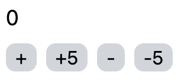
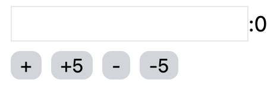

<!--  -->

<!-- omit in toc -->
# グローバルな状態管理 zustand

<!-- omit in toc -->
## 目次
- [グローバルな状態管理](#グローバルな状態管理)
- [zustandとは？](#zustandとは)
- [インストール](#インストール)
- [storeの作成](#storeの作成)
- [コンポーネントからの参照](#コンポーネントからの参照)
  - [準備](#準備)
  - [実装](#実装)
- [注意点](#注意点)
  - [セレクタの実装](#セレクタの実装)
    - [具体例](#具体例)
  - [複数ストアの作成](#複数ストアの作成)
- [slice patternによる状態ごとのファイル分け](#slice-patternによる状態ごとのファイル分け)
- [Prev: Chapter8 カスタムフック](#prev-chapter8-カスタムフック)

## グローバルな状態管理

グローバルな状態管理の目的は、5章の[グローバルな状態管理](./chapter5.md#グローバルな状態管理usecontextの目的)であった通り、propsリレーによって上位のコンポーネントが肥大化するのを防ぐためにあります。

この目的のためだけなら、React公式の`useContext`を使うことで実現できますが、`useContext`はパフォーマンス面で問題があります。それは、グローバルな状態が更新された時、そのContextの`Provider`の全ての子コンポーネントが再計算されます。このため再計算が必要なコンポーネントはグローバルな状態を参照している箇所だけのはずですが、参照していないコンポーネントも再計算されてしまいます。

これを防止するために、ここではライブラリを導入します。

React向けのグローバルな状態管理ライブラリは、例えば、以下のようなものがあります。
- Redux
- Zustand
- Jotai
- Recoil

ここで挙げたライブラリは、どれも有名で思想に合うものを使うと良いと思います。

この中で最も使われているライブラリは、Reduxですが、少々難しい部分もあり、学習コストが高いことが欠点です。そこで、ここではReduxと同じような思想で、もっと簡単に使えるようにしたZustandを使っていきます。

## zustandとは？
[zustand](https://zustand-demo.pmnd.rs/)はグローバルな状態管理を行うライブラリです。

zustandでは、管理する状態の初期値と更新用の関数から、storeを作成します。各コンポーネントは、このstoreから現在の状態を参照したり、storeの更新用の関数を使って、状態の更新を行います。

※zustandに限らず、多くのグローバルな状態管理ライブラリで当てはまります。

これは、5章で出てきた`useReducer`とアイデアが似ています。zustandにも`useReducer`と似たような以下の利点があります。

1. 更新の方法を限定できる
2. 状態や更新用の関数をpropsで渡す必要がない（グローバルな状態管理の利点）
3. 更新用の関数は、純粋関数

以下は、`useReducer`の利点です。（[5章useReducerの利点](./chapter5.md#usereducerの利点)より抜粋）
> 1. **更新の方法を、限定できる**：
  `useReducer`は、`reducer`で定義された方法でしか状態の更新ができません。そのため、勝手に書き換えられたくないプロパティがある場合や、他のプロパティから自動的に計算されるプロパティなどがある場合に、勝手な書き換えや更新のし忘れを防ぐことができます。
>
> 2. **更新用の関数は、`dispatch`のみ**：
  1の利点は、`useState`でも更新用の関数を1つ1つ定義すれば、実現できます。ただ、子コンポーネントに大量の更新用の関数を渡すと`props`が煩雑になってしまい、可読性が落ちてしまいます。`useReducer`であれば、更新用の関数は、`dispatch`のみなので、子コンポーネントにも`dispatch`を渡すだけで十分です。
>
> 3. **`reducer`は、純粋関数**：
  `reducer`は、`state`に依存せず純粋な関数として定義ができます。そのため、`reducer`の単体テストを書くことができます。

さて、次からはzustandの使い方を見ていきましょう。

## インストール

以下のコマンドでインストールできます。
```shell
npm install zustand
```

公式のガイドは[こちら](https://docs.pmnd.rs/zustand/getting-started/introduction#installation)

## storeの作成
それでは、storeを作成します。カウンターの状態を管理することを想定したstoreを作成します。
グローバルな状態storeは、慣習的に`src/store`で管理されることが多いです。`src/store/index.ts`ファイルを作成し、以下のように記述してください。

`src/store/index.ts`
```typescript
import { create } from "zustand";

interface CounterState {
  count: number;
  increase: (by: number) => void;
  decrease: (by: number) => void;
}

export const useCounterStore = create<CounterState>()((set) => ({
  count: 0,
  increase: (by) => set((state) => ({ count: state.count + by })),
  decrease: (by) => set((state) => ({ count: state.count - by })),
}));
```

## コンポーネントからの参照

それでは、定義したグローバルな状態をコンポーネントから参照、更新を行ってみましょう。

カウンターの数値表示とカウンターの増減を行うボタンで2つのコンポーネントに分けて実装していきます。

### 準備
まずは、利用するコンポーネントの準備を行います。

カウンターの数値表示のコンポーネント`CountDisplay`コンポーネントを作ります。以下のファイルを作ってください。

`src/components/CountDisplay.tsx`
```jsx
const CountDisplay: React.FC = () => {
  const count = 0;
  return <div className="text-lg">{count}</div>;
};

export default CountDisplay;
```

次に、カウンターの数字を増減させるボタンのコンポーネントを作ります。以下のファイルを作ってください。

`src/components/CountControls.tsx`
```jsx
const CountControls = () => {
  return (
    <div className="flex items-center space-x-2">
      <button className="rounded-lg bg-gray-300 px-2" onClick={() => {}}>
        +
      </button>
      <button className="rounded-lg bg-gray-300 px-2" onClick={() => {}}>
        +5
      </button>
      <button className="rounded-lg bg-gray-300 px-2" onClick={() => {}}>
        -
      </button>
      <button className="rounded-lg bg-gray-300 px-2" onClick={() => {}}>
        -5
      </button>
    </div>
  );
};

export default CountControls;
```

最後に、`App`コンポーネントを以下のように修正し、実行結果が表示されるようにしましょう。

`src/App.tsx`
```jsx
import CountControls from "./components/CountControls";
import CountDisplay from "./components/CountDisplay";

function App() {
  return (
    <div className="m-4 space-y-2">
      <CountDisplay />
      <CountControls />
    </div>
  );
}

export default App;
```

一度、`npm run dev`を実行し、ブラウザで結果を確認しましょう。



### 実装

ここから、グローバルな状態を参照し、カウンターに機能をつけていきましょう。

`CountDiplay`コンポーネントでは、`count`をグローバルな状態から取得します。グローバルな状態を参照する場合、以下のように行います。
```jsx
const count = useCounterStore((state) => state.count);
```

ここで`useCounterStore`は、`src/store/index.ts`に定義したものをインポートして使います。そして`useCounterStore`の引数には、関数を渡します。この関数は、グローバルな状態全てを受け取り、その中から利用するものだけを返す関数にします。`(state) => state.count`（セレクタと呼ばれます）

※グローバルな状態全てとは、状態そのものと更新用の関数も含みます。

それでは、コンポーネントに反映しましょう。以下のように修正してください。

`src/components/CountDisplay.tsx`
```jsx
import { useCounterStore } from "../store";

const CountDisplay: React.FC = () => {
  const count = useCounterStore((state) => state.count);
  return <div className="text-lg">{count}</div>;
};

export default CountDisplay;
```

`CountControls`コンポーネントでは、更新用の関数を取得します。
`CountControls`コンポーネントを以下のように修正しましょう。

`src/components/CountControls.tsx`
```jsx
import { useCounterStore } from "../store";

const CountControls = () => {
  const increase = useCounterStore((state) => state.increase);
  const decrease = useCounterStore((state) => state.decrease);
  return (
    <div className="flex items-center space-x-2">
      <button
        className="rounded-lg bg-gray-300 px-2"
        onClick={() => {
          increase(1);
        }}
      >
        +
      </button>
      <button
        className="rounded-lg bg-gray-300 px-2"
        onClick={() => {
          increase(5);
        }}
      >
        +5
      </button>
      <button
        className="rounded-lg bg-gray-300 px-2"
        onClick={() => {
          decrease(1);
        }}
      >
        -
      </button>
      <button
        className="rounded-lg bg-gray-300 px-2"
        onClick={() => {
          decrease(5);
        }}
      >
        -5
      </button>
    </div>
  );
};

export default CountControls;
```

`npm run dev`を実行し、ブラウザで結果を確認しましょう。以下のように動作すれば成功です。

- +ボタンでカウントが+1
- +5ボタンでカウントが+5
- -ボタンでカウントが-1
- -5ボタンでカウントが-5

以上のように、グローバルな状態管理は、propsリレーを行うことなく、値の参照・更新ができます。

## 注意点
zustandを利用する上での注意点を説明します。

### セレクタの実装
セレクタとは、グローバルな状態を参照する際に、どの値・関数を参照するか設定する関数です。上記の例では、`(state) => state.count`の部分のことです。

セレクタは、`(state) => state.attr`のように`state`のある属性を参照したものを返す関数にすることをお勧めします。

しかし、グローバルな状態の使われ方次第で、セレクタにもう少し処理を加えたい場合が出てくるでしょう。それは、以下のような場合です。

- 状態に変換を加えてオブジェクトにしてから使いたい
- 状態がリストで、`filter`メソッドを使って、条件に当てはまるものだけ使いたい

このような処理をセレクタに加えることは出来るのですが、処理によってはパフォーマンスに問題が出てきます。その一例を紹介します。

#### 具体例
以下のような配列の`store`を作成している場合です。
```jsx
const useSomeStore = create<any>()((set) => ({
  some: [
    { a: 1, b: 2 },
    { a: 5, b: 10 },
    { a: 3, b: 12 },
    { a: 6, b: 4 },
  ],
}));
```

コンポーネントで使うとき、グローバルな状態`some`配列の`a`が5以上のみのものだけ欲しいとします。そうすると、セレクタを以下のように設定するのが、良さそうです。

```jsx
const some = useSomeStore((state) => state.some.filter((s) => s.a >= 5));
```

しかしながら、`filter`メソッドを使うと、実行ごとに新しい配列が返されることになります。新しい配列になるとReactが変更があったと検知し、実際には、変更されていないのに、再計算されてしまう可能性があります。

そのため、基本的には、セレクタは`(state) => state.some`などシンプルな形式が望ましいです。

また、複数の状態を一度に取り出す`(state) => ({ a: state.a, b: state.b })`などの処理も毎回新しいオブジェクトを生成することになるので、注意しましょう。`state`は１つ１つ取り出すようにしましょう。

どうしても複数の状態を１つのセレクタで取り出したい場合、公式のGithubに方法が載っています。

[https://github.com/pmndrs/zustand?tab=readme-ov-file#selecting-multiple-state-slices](https://github.com/pmndrs/zustand?tab=readme-ov-file#selecting-multiple-state-slices)

### 複数ストアの作成
グローバルな状態が増えてくると、storeを複数定義したいという場合が出てきます。以下のように定義することはできますが、公式では非推奨となっています。

```jsx
// 以下のように複数のstoreを作成することはできるが、
// 公式では、非推奨です。
export const useCounterStore = create<CounterState>()((set) => ({
  count: 0,
  increase: (by) => set((state) => ({ count: state.count + by })),
  decrease: (by) => set((state) => ({ count: state.count - by })),
}));

export const useSomeStore = create<any>()((set) => ({
  some: [
    { a: 1, b: 2 },
    { a: 5, b: 10 },
    { a: 3, b: 12 },
    { a: 6, b: 4 },
  ],
}));
```

公式の推奨は、以下のリンクで説明があるように、単一のstoreです。
[https://docs.pmnd.rs/zustand/guides/flux-inspired-practice#single-store](https://docs.pmnd.rs/zustand/guides/flux-inspired-practice#single-store)

storeは単一ですが、slice patternを使うことで、自分が分けたい状態ごとにファイルを分けることができます。これは、[sliceによる状態ごとのファイル分け](#sliceによる状態ごとのファイル分け)で実際に実装します。

公式の説明は、[こちら](https://docs.pmnd.rs/zustand/guides/slices-pattern)です。


## slice patternによる状態ごとのファイル分け
ここからslice patternを使ってファイル分けを行っていきます。sliceとは、storeを分けた時の単位のことです。

まずは、状態を分ける前のstoreを作りましょう。`src/store/index.ts`を修正していきます。

`src/store/index.ts`
```jsx
import { create } from "zustand";

interface StoreState {
  count: number;
  text: string;
  increase: (by: number) => void;
  decrease: (by: number) => void;
  changeText: (newValue: string) => void;
}

export const useStore = create<StoreState>()((set) => ({
  count: 0,
  text: "",
  increase: (by) => set((state) => ({ count: state.count + by })),
  decrease: (by) => set((state) => ({ count: state.count - by })),
  changeText: (newValue) => set(() => ({ text: newValue })),
}));
```

以前定義していた`useCountStore`を使っているコンポーネントも修正し、グローバルな状態`text`も表示変更できるようにしましょう。

`src/components/CountDisplay.tsx`
```jsx
import { useStore } from "../store";

const CountDisplay: React.FC = () => {
  const count = useStore((state) => state.count);
  const text = useStore((state) => state.text);
  const changeText = useStore((state) => state.changeText);
  return (
    <div className="text-lg">
      <input
        className="border"
        value={text}
        onChange={(e) => {
          changeText(e.target.value);
        }}
      />
      :{count}
    </div>
  );
};

export default CountDisplay;
```

`src/components/CountControls.tsx`
```jsx
import { useStore } from "../store";

const CountControls = () => {
  const increase = useStore((state) => state.increase);
  const decrease = useStore((state) => state.decrease);

  return (
    <div className="flex items-center space-x-2">
      <button
        className="rounded-lg bg-gray-300 px-2"
        onClick={() => {
          increase(1);
        }}
      >
        +
      </button>
      <button
        className="rounded-lg bg-gray-300 px-2"
        onClick={() => {
          increase(5);
        }}
      >
        +5
      </button>
      <button
        className="rounded-lg bg-gray-300 px-2"
        onClick={() => {
          decrease(1);
        }}
      >
        -
      </button>
      <button
        className="rounded-lg bg-gray-300 px-2"
        onClick={() => {
          decrease(5);
        }}
      >
        -5
      </button>
    </div>
  );
};

export default CountControls;
```

これで一旦、動作確認しましょう。`npm run dev`を実行し、ブラウザで結果を確認してください。



それでは、動作を変えずにStoreをsliceに分けていきましょう。storeを分ける場合、`src/store/modules`ディレクトリにsliceを記述し、`src/store/index.ts`には、sliceを統合する処理などを記述します。

まずは、もともと定義していた`count`に関わるものをファイル分けします。`src/store/modules/count.ts`ファイルを作成してください。

`src/store/modules/count.ts`
```jsx
import { StateCreator } from "zustand";

export interface CountSlice {
  count: number;
  increase: (by: number) => void;
  decrease: (by: number) => void;
}

export const createCountSlice: StateCreator<any, [], [], CountSlice> = (
  set,
) => ({
  count: 0,
  increase: (by) => set((state) => ({ count: state.count + by })),
  decrease: (by) => set((state) => ({ count: state.count - by })),
});
```

`createCountSlice`を定義していますが、`zustand`の`create`関数に渡していたものと同じ形式です。これは、`zustand`の`StateCreator`となるのですが、`StateCreator`に渡している型引数ですが、`StateCreator<{ストア全体のStateの型}, [], [], {このsliceの型}>`とします。ストア全体の型は、後で定義するので、今は`any`としておきます。

次は、`text`のsliceを作成しましょう。以下のファイルを作ってください。

`src/store/modules/text.ts`
```jsx
import { StateCreator } from "zustand";

export interface TextSlice {
  text: string;
  changeText: (newValue: string) => void;
}

export const createTextSlice: StateCreator<any, [], [], TextSlice> = (set) => ({
  text: "",
  changeText: (newValue) => set(() => ({ text: newValue })),
});
```

それでは、次に定義したsliceを結合し、storeを作成します。

`src/store/index.ts`
```jsx
import { create } from "zustand";
import { CountSlice, createCountSlice } from "./modules/count";
import { TextSlice, createTextSlice } from "./modules/text";

type StoreState = CountSlice & TextSlice;

export const useStore = create<StoreState>()((...a) => ({
  ...createCountSlice(...a),
  ...createTextSlice(...a),
}));
```

ここで、ストア全体のStateの型`StoreState`を定義したので、これを使ってsliceの方も書き換えていきましょう。

`src/store/modules/count.ts`
```jsx
// 一部省略
import { StoreState } from "..";

export const createCountSlice: StateCreator<StoreState, [], [], CountSlice> = ...
```

`src/store/modules/text.ts`
```jsx
// 一部省略
import { StoreState } from "..";

export const createTextSlice: StateCreator<StoreState, [], [], TextSlice> = ...
```

これで、`npm run dev`を実行し、ブラウザで結果を確認してください。sliceに分ける前と同じ動作なら成功です。

## [Prev: Chapter8 カスタムフック](../chapters/chapter8.md)

<!--  -->