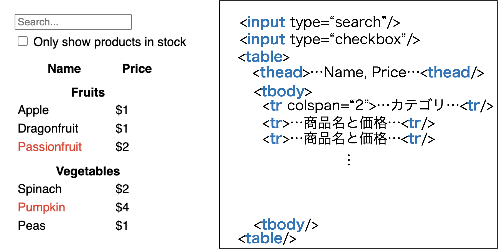
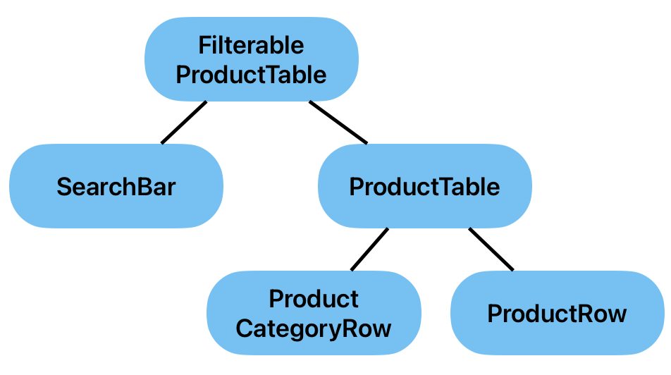
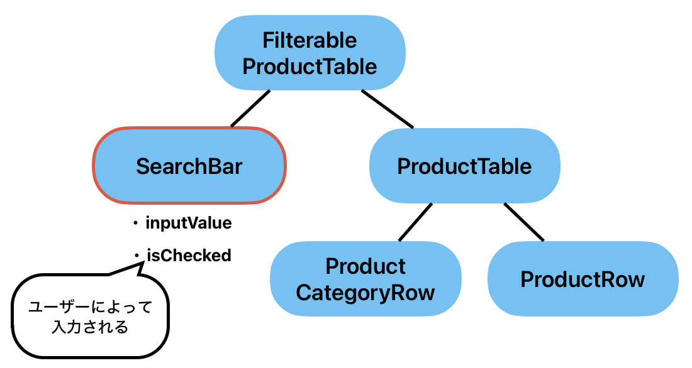
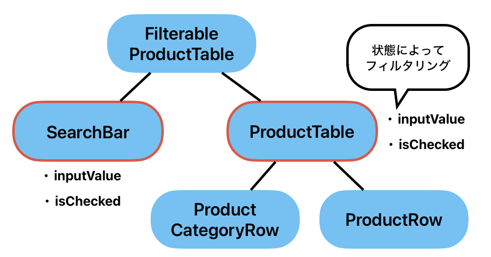
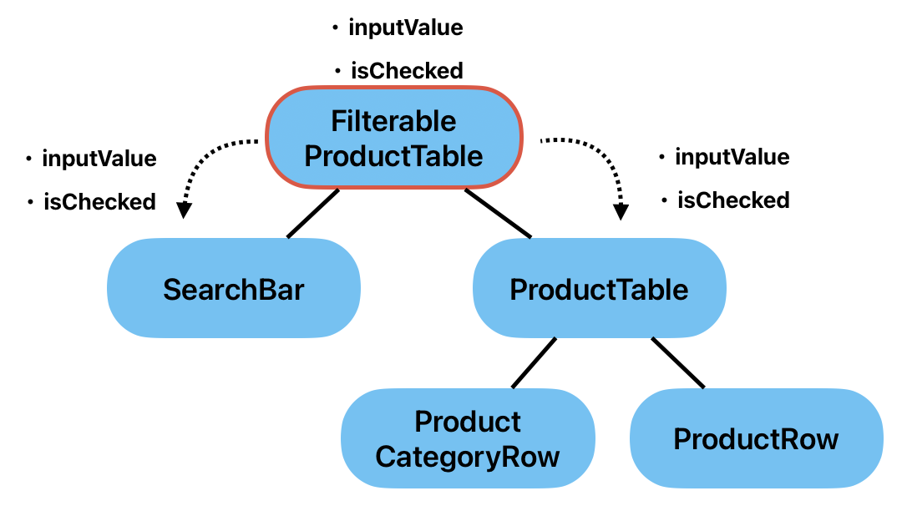
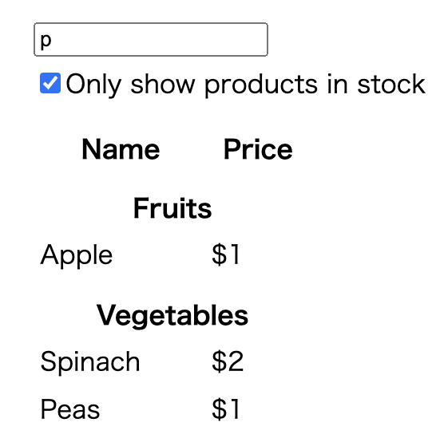

<!--  -->

<!-- omit in toc -->
# コンポーネント指向
ここでは、Reactのコンポーネント指向を身につけるための演習を行います。公式サイトの[クイックスタート>Reactの流儀](https://ja.react.dev/learn/thinking-in-react)を参考に作成しています。

アイコンの説明
- 📝　実践してほしいところ
- 💡　解答例

<!-- omit in toc -->
## 目次
- [前提条件](#前提条件)
- [準備](#準備)
- [コンポーネントに分割する](#コンポーネントに分割する)
  - [💡分割例](#分割例)
- [画面全体のDOM構成を考える](#画面全体のdom構成を考える)
  - [💡DOM構成の例](#dom構成の例)
- [静的な画面を実装する](#静的な画面を実装する)
  - [💡静的な`ProductTable`コンポーネントの実装例（初心者向け）](#静的なproducttableコンポーネントの実装例初心者向け)
    - [準備](#準備-1)
    - [`ProductTable`を子コンポーネント無しで実装](#producttableを子コンポーネント無しで実装)
    - [`ProductTable`を子コンポーネント有りで実装](#producttableを子コンポーネント有りで実装)
  - [💡全コンポーネントの実装例](#全コンポーネントの実装例)
- [Stateを保持するコンポーネントを考える](#stateを保持するコンポーネントを考える)
  - [保持するべきStateを見つける](#保持するべきstateを見つける)
  - [Stateを使うコンポーネントを見つける](#stateを使うコンポーネントを見つける)
  - [それらのコンポーネントの共通の親を見つける](#それらのコンポーネントの共通の親を見つける)
- [動的な画面を実装する](#動的な画面を実装する)
  - [💡実装例](#実装例)

## 前提条件
APIからすでに以下のような商品データが取得できていることを前提とします。
```js
[
  { category: "Fruits", price: "$1", stocked: true, name: "Apple" },
  { category: "Fruits", price: "$1", stocked: true, name: "Dragonfruit" },
  { category: "Fruits", price: "$2", stocked: false, name: "Passionfruit" },
  { category: "Vegetables", price: "$2", stocked: true, name: "Spinach" },
  { category: "Vegetables", price: "$4", stocked: false, name: "Pumpkin" },
  { category: "Vegetables", price: "$1", stocked: true, name: "Peas" }
]
```

画面のモックアップは、以下です。


画面の仕様は以下の通りです。

- 検索ボックス
  - 文字入力。入力した文字と部分一致する商品だけ表示される。
- チェックボックス
  - チェックをつけると`stocked`が`true`のものだけ表示される。
- 表
  - 条件に当てはまる商品をカテゴリごとに表示する。
  - デフォルトでは、全商品を表示する。
  - `stocked`が`false`の商品は、名前を赤字で表示する。

## 準備
コーディングの準備を行います。
以下のコマンドでプロジェクトテンプレートを作成してください。
```shell
npm create vite@latest
```

frameworkはReact, vatiantはTypescript or Typescript + SWCを選択してください。
```shell
? Project name: > vite-project
? Select a framework: › - Use arrow-keys. Return to submit.
    Vanilla
    Vue
❯   React
    Preact
    Lit
    Svelte
    Solid
    Qwik
    Others
? Select a variant: › - Use arrow-keys. Return to submit.
❯   TypeScript
    TypeScript + SWC
    JavaScript
    JavaScript + SWC
```

また、ここではstyleについては、演習の対象としていないので、`index.css`を以下のように変更してください。

`src/index.css`
```css
body {
  font-family: sans-serif;
  margin: 20px;
  padding: 5px;
}

label {
  display: block;
  margin-top: 5px;
  margin-bottom: 5px;
}

th {
  padding-top: 10px;
}

td {
  padding: 2px;
  padding-right: 40px;
}
```

商品情報は`App`コンポーネントが持っていることとします。`src/App.tsx`を以下のように修正してください。

`src/App.tsx`
```jsx
export interface Product {
  category: string;
  price: string;
  stocked: boolean;
  name: string;
}

function App() {
  const products: Product[] = [
    { category: "Fruits", price: "$1", stocked: true, name: "Apple" },
    { category: "Fruits", price: "$1", stocked: true, name: "Dragonfruit" },
    { category: "Fruits", price: "$2", stocked: false, name: "Passionfruit" },
    { category: "Vegetables", price: "$2", stocked: true, name: "Spinach" },
    { category: "Vegetables", price: "$4", stocked: false, name: "Pumpkin" },
    { category: "Vegetables", price: "$1", stocked: true, name: "Peas" },
  ];
  return <></>;
}

export default App;
```

## コンポーネントに分割する
モックアップの画面をコンポーネントに分割し、コンポーネントの名前を付けてみましょう。分割の仕方は、人によって様々です。設計や実装する他の画面などによっても変わってきます。

ただし、コンポーネント分割を行う際は、[単一責任の原則](https://ja.wikipedia.org/wiki/%E5%8D%98%E4%B8%80%E8%B2%AC%E4%BB%BB%E3%81%AE%E5%8E%9F%E5%89%87)（1つのコンポーネントは、1つのことだけを行う）を意識して、分割していきましょう。

📝 **モックアップ画面を見ながら、コンポーネントに分割してみましょう！**


<br/>
<br/>
<br/>

### 💡分割例
ここからは、以下の画像のようにコンポーネントを分割したと仮定して、話を進めていきます。


## 画面全体のDOM構成を考える
画面がどのようなDOMで構成されているのかを考えます。慣れないうちは、コードを書きながらでも良いです。

📝 **モックアップ画面を見ながら、DOMの構成を考えてみましょう!**


<br/>
<br/>
<br/>

### 💡DOM構成の例
画面全体のDOMのイメージ


実際にhtmlを書いてみると以下のようになります。
```html
<input type="search" />
<label>
  <input type="checkbox" />
  Only show products in stock
</label>

<table>
  <thead>
    <tr>
      <th>Name</th>
      <th>Price</th>
    </tr>
  </thead>
  <tbody>
    <tr>
      <th colspan="2">Fruits</th>
    </tr>
    <tr>
      <td>Apple</td>
      <td>$1</td>
    </tr>
  </tbody>
</table>
```

## 静的な画面を実装する
まずは、ユーザーの入力によって表示が変わる部分などは考慮せず、商品全てが表示される画面を作っていきましょう。

初めのうちは、末端の子コンポーネントから実装していくのではなく、ある程度上の親コンポーネントから実装し、後で細かくコンポーネントに分離させてゆくのが、実装しやすいです。

📝　**各コンポーネントを実装してみましょう！**


<br/>
<br/>
<br/>


### 💡静的な`ProductTable`コンポーネントの実装例（初心者向け）
`ProductTable`コンポーネントを具体例として、実装していきましょう。

#### 準備
まずは、`ProductTable`コンポーネントとその親コンポーネントを定義するファイルを作っていきましょう。また、`App`コンポーネントが持っている`products`を`props`で渡して、`ProductTable`が受け取れるようにしましょう。

`src/components/ProductTable.tsx`
```jsx
import { Product } from "../App";

interface ProductTableProps {
  products: Product[];
}

const ProductTable: React.FC<ProductTableProps> = ({ products }) => {
  return <></>;
};

export default ProductTable;
```

`src/components/FilterableProductTable.tsx`
```jsx
import { Product } from "../App";
import ProductTable from "./ProductTable";

interface FilterableProductTableProps {
  products: Product[];
}

const FilterableProductTable: React.FC<FilterableProductTableProps> = ({
  products,
}) => {
  return <ProductTable products={products} />;
};

export default FilterableProductTable;
```

そして、`App`コンポーネントを以下のように修正します。

`src/App.tsx`
```jsx
import FilterableProductTable from "./components/FilterableProductTable";

export interface Product {
  category: string;
  price: string;
  stocked: boolean;
  name: string;
}

function App() {
  const products: Product[] = [
    { category: "Fruits", price: "$1", stocked: true, name: "Apple" },
    { category: "Fruits", price: "$1", stocked: true, name: "Dragonfruit" },
    { category: "Fruits", price: "$2", stocked: false, name: "Passionfruit" },
    { category: "Vegetables", price: "$2", stocked: true, name: "Spinach" },
    { category: "Vegetables", price: "$4", stocked: false, name: "Pumpkin" },
    { category: "Vegetables", price: "$1", stocked: true, name: "Peas" },
  ];
  return <FilterableProductTable products={products} />;
}

export default App;
```

#### `ProductTable`を子コンポーネント無しで実装
それでは、`ProductTable`を子コンポーネント無しで実装していきます。基本的には、[画面全体のDOM構成を考える](#画面全体のdom構成を考える)で記述したhtmlの`table`タグ部分になりますが、表の中身は`products`を使って構成していきましょう。

`src/components/ProductTable.tsx`
```jsx
import { Product } from "../App";

interface ProductTableProps {
  products: Product[];
}

const ProductTable: React.FC<ProductTableProps> = ({ products }) => {
  // category一覧を作成
  const categories = products.reduce<string[]>((prev, current) => {
    if (!prev.includes(current.category)) prev.push(current.category);
    return prev;
  }, []);

  return (
    <table>
      <thead>
        <tr>
          <th>Name</th>
          <th>Price</th>
        </tr>
      </thead>
      <tbody>
        {categories.map((category) => {
          // カテゴリに属する商品をピックアップ
          const categoryProducts = products.filter(
            (product) => product.category === category
          );
          return (
            <>
              {/* カテゴリの表示 */}
              <tr key={category}>
                <th colSpan={2}>{category}</th>
              </tr>
              {/* 名前、価格の表示 */}
              {categoryProducts.map((product) => (
                <tr key={product.name}>
                  <td style={{ color: product.stocked ? undefined : "red" }}>
                    {product.name}
                  </td>
                  <td>{product.price}</td>
                </tr>
              ))}
            </>
          );
        })}
      </tbody>
    </table>
  );
};

export default ProductTable;
```

上記で実装した`ProductTable`コンポーネントを別のコンポーネントにしていく部分を探します。以下の`tbody`タグに指定している部分であることは、すぐ分かると思います。

```jsx
<tbody>
  {categories.map((category) => {
    const categoryProducts = products.filter(
      (product) => product.category === category
    );
    return (
      <>
        {/* ProductCategoryRowコンポーネント */}
        <tr key={category}>
          <th colSpan={2}>{category}</th>
        </tr>
        {/* ProductRowコンポーネント */}
        {categoryProducts.map((product) => (
          <tr key={product.name}>
            <td style={{ color: product.stocked ? undefined : "red" }}>
              {product.name}
            </td>
            <td>{product.price}</td>
          </tr>
        ))}
      </>
    );
  })}
</tbody>
```

#### `ProductTable`を子コンポーネント有りで実装
`ProductCategoryRow`と`ProductRow`コンポーネントを実装していきましょう。

`src/components/ProductCategoryRow.tsx`
```jsx
interface ProductCategoryRowProps {
  category: string;
}

const ProductCategoryRow: React.FC<ProductCategoryRowProps> = ({
  category,
}) => {
  return (
    <tr>
      <th colSpan={2}>{category}</th>
    </tr>
  );
};

export default ProductCategoryRow;
```

`src/components/ProductRow.tsx`
```jsx
interface ProductRowProps {
  name: string;
  price: string;
  isStocked: boolean;
}

const ProductRow: React.FC<ProductRowProps> = ({ name, price, isStocked }) => {
  return (
    <tr>
      <td style={{ color: isStocked ? undefined : "red" }}>{name}</td>
      <td>{price}</td>
    </tr>
  );
};

export default ProductRow;
```

次に`ProductCategoryRow`と`ProductRow`コンポーネントを使って`ProductTable`コンポーネントを書き換えていきます。

```jsx
import { Product } from "../App";
import ProductCategoryRow from "./ProductCategoryRow";
import ProductRow from "./ProductRow";

interface ProductTableProps {
  products: Product[];
}

const ProductTable: React.FC<ProductTableProps> = ({ products }) => {
  // category一覧を作成
  const categories = products.reduce<string[]>((prev, current) => {
    if (!prev.includes(current.category)) prev.push(current.category);
    return prev;
  }, []);

  return (
    <table>
      <thead>
        <tr>
          <th>Name</th>
          <th>Price</th>
        </tr>
      </thead>
      <tbody>
        {categories.map((category) => {
          // カテゴリに属する商品をピックアップ
          const categoryProducts = products.filter(
            (product) => product.category === category
          );
          return (
            <>
              {/* カテゴリの表示 */}
              <ProductCategoryRow category={category} key={category} />
              {/* 名前、価格の表示 */}
              {categoryProducts.map((product) => (
                <ProductRow
                  name={product.name}
                  price={product.price}
                  isStocked={product.stocked}
                />
              ))}
            </>
          );
        })}
      </tbody>
    </table>
  );
};

export default ProductTable;
```

これで、`ProductTable`コンポーネントとその子コンポーネントの実装は完了です。

### 💡全コンポーネントの実装例

以下に、全てのコンポーネントの実装例を示します。

`src/App.tsx`
```jsx
import FilterableProductTable from "./components/FilterableProductTable";

export interface Product {
  category: string;
  price: string;
  stocked: boolean;
  name: string;
}

function App() {
  const products: Product[] = [
    { category: "Fruits", price: "$1", stocked: true, name: "Apple" },
    { category: "Fruits", price: "$1", stocked: true, name: "Dragonfruit" },
    { category: "Fruits", price: "$2", stocked: false, name: "Passionfruit" },
    { category: "Vegetables", price: "$2", stocked: true, name: "Spinach" },
    { category: "Vegetables", price: "$4", stocked: false, name: "Pumpkin" },
    { category: "Vegetables", price: "$1", stocked: true, name: "Peas" },
  ];

  return (
    <div>
      <FilterableProductTable products={products} />
    </div>
  );
}

export default App;
```

`src/components/FilterableProductTable.tsx`
```jsx
import { Product } from "../App";
import ProductTable from "./ProductTable";
import SearchBar from "./SearchBar";

interface FilterableProductTableProps {
  products: Product[];
}

const FilterableProductTable: React.FC<FilterableProductTableProps> = ({
  products,
}) => {
  return (
    <div>
      <SearchBar />
      <ProductTable products={products} />
    </div>
  );
};

export default FilterableProductTable;
```

`src/components/SearchBar.tsx`
```jsx
interface SearchBarProps {}

const SearchBar: React.FC<SearchBarProps> = () => {
  return (
    <div>
      <input type="search" />
      <label>
        <input type="checkbox" />
        Only show products in stock
      </label>
    </div>
  );
};

export default SearchBar;
```

`src/components/ProductTable.tsx`
```jsx
import { Product } from "../App";
import ProductCategoryRow from "./ProductCategoryRow";
import ProductRow from "./ProductRow";

interface ProductTableProps {
  products: Product[];
}

const ProductTable: React.FC<ProductTableProps> = ({ products }) => {
  // category一覧を作成
  const categories = products.reduce<string[]>((prev, current) => {
    if (!prev.includes(current.category)) prev.push(current.category);
    return prev;
  }, []);

  return (
    <table>
      <thead>
        <tr>
          <th>Name</th>
          <th>Price</th>
        </tr>
      </thead>
      <tbody>
        {categories.map((category) => {
          // カテゴリに属する商品をピックアップ
          const categoryProducts = products.filter(
            (product) => product.category === category
          );
          return (
            <>
              {/* カテゴリの表示 */}
              <ProductCategoryRow category={category} key={category} />
              {/* 名前、価格の表示 */}
              {categoryProducts.map((product) => (
                <ProductRow
                  name={product.name}
                  price={product.price}
                  isStocked={product.stocked}
                />
              ))}
            </>
          );
        })}
      </tbody>
    </table>
  );
};

export default ProductTable;
```

`src/components/ProductCategoryRow.tsx`
```jsx
interface ProductCategoryRowProps {
  category: string;
}

const ProductCategoryRow: React.FC<ProductCategoryRowProps> = ({
  category,
}) => {
  return (
    <tr>
      <th colSpan={2}>{category}</th>
    </tr>
  );
};

export default ProductCategoryRow;
```

`src/components/ProductRow.tsx`
```jsx
interface ProductRowProps {
  name: string;
  price: string;
  isStocked: boolean;
}

const ProductRow: React.FC<ProductRowProps> = ({ name, price, isStocked }) => {
  return (
    <tr>
      <td style={{ color: isStocked ? undefined : "red" }}>{name}</td>
      <td>{price}</td>
    </tr>
  );
};

export default ProductRow;
```


## Stateを保持するコンポーネントを考える
Stateを保持するコンポーネントを考えるには、以下のステップで行っていきます。
1. 保持するべきStateを見つける
2. Stateを使うコンポーネントを見つける
3. それらのコンポーネントの共通の親を見つける

この手順で見つけた親コンポーネントが、Stateを保持するコンポーネントです。

### 保持するべきStateを見つける
   
はじめに、この画面が保持するべきStateを挙げていきましょう。保持するべきStateは、ユーザーによって変更が行われる箇所もしくは、外部のAPIなどから入手するデータがほとんどです。

今回、APIから入手するデータは、定数として考えるので、ユーザーによって変更が行われる箇所を見てみましょう。

📝　**ユーザーによって変更が行われる箇所に注目して、保持するべきStateを考えてみましょう!**

<br/>
<br/>
<br/>

💡保持するべきStateは、`SearchBar`コンポーネント内の`input`の内容と`checkbox`のチェックの状態だと分かります。

### Stateを使うコンポーネントを見つける
次に、コンポーネントの親子関係をはっきりさせるために、コンポーネントツリーを考えてみましょう。コンポーネントツリーとは、コンポーネントを木構造にしたもので、親コンポーネントが親ノード、子コンポーネントが子ノードになります。

📝 **`FilterableProductTable`コンポーネントを根ノードとして、コンポーネントツリーを書いてみましょう!**

<br/>
<br/>
<br/>

💡`FilterableProductTable`コンポーネントを根ノードとして、コンポーネントツリーを書くと以下のようになります。



Stateを保持するべきコンポーネントは、そのStateを利用する全てのコンポーネントの共通の親コンポーネントになります。

今回、保持するべき値は、`input`の内容と`checkbox`のチェックの状態です。これらを利用するコンポーネントを考えていきましょう。

📝 **`input`の内容と`checkbox`のチェックの状態を利用するコンポーネントは、どれか考えてみましょう!**

<br/>
<br/>
<br/>

ユーザーが入力する部分の`SearchBar`コンポーネントが利用することは、すぐに分かるかと思います。それでは、他にそのStateを利用するコンポーネントは、どれでしょうか？



それは、`ProductTable`コンポーネントです。`ProductTable`コンポーネントは、`input`の内容と`checkbox`のチェックの状態に応じて、表示する子コンポーネントを変更する必要があります。



### それらのコンポーネントの共通の親を見つける
📝 **それでは、`SearchBar`コンポーネントと`ProductTable`コンポーネントの共通の親コンポーネントを見つけましょう!**

<br/>
<br/>
<br/>

💡コンポーネントツリーをみると簡単に分かります。共通の親コンポーネントは、`FilterableProductTable`です。このコンポーネントで、`useState`を使って、`input`の内容と`checkbox`のチェックの状態を保持し、propsでそれらのstateを子コンポーネントに渡しましょう。



## 動的な画面を実装する
まずは、`FilterableProductTable`コンポーネントで`useState`を使って、`input`の内容と`checkbox`のチェックの状態を保持しましょう。

`src/components/FilterableProductTable.tsx`
```jsx
import { useState } from "react";
import { Product } from "../App";
import ProductTable from "./ProductTable";
import SearchBar from "./SearchBar";

interface FilterableProductTableProps {
  products: Product[];
}

const FilterableProductTable: React.FC<FilterableProductTableProps> = ({
  products,
}) => {
  const [filterText, setFilterText] = useState("");
  const [inStockOnly, setInStockOnly] = useState(false);

  return (
    <div>
      <SearchBar />
      <ProductTable products={products} />
    </div>
  );
};

export default FilterableProductTable;
```

ここから、保持した状態を`SearchBar`と`ProductTable`コンポーネントにprops経由で渡し、`SearchBar`では状態の更新を行い、`ProductTable`は、状態に応じて`products`をフィルタリングしましょう。

📝　**それでは、実際に`src/components/FilterableProductTable.tsx`、`src/components/SearchBar.tsx`、`src/components/ProductTable.tsx`を変更し、フィルタリングができるようにしましょう。**

以下にコメントでヒントを書いています。

`src/components/FilterableProductTable.tsx`
```jsx
// 省略

const FilterableProductTable: React.FC<FilterableProductTableProps> = ({
  products,
}) => {
  const [filterText, setFilterText] = useState("");
  const [inStockOnly, setInStockOnly] = useState(false);

  return (
    <div>
      {/** SearchBarに必要な状態をpropsで渡す */}
      <SearchBar />
      {/** ProductTableに必要な状態をpropsで渡す */}
      <ProductTable products={products} />
    </div>
  );
};

export default FilterableProductTable;
```

`src/components/SearchBar.tsx`
```jsx
interface SearchBarProps {
  /** propsで必要な状態を受け取れるようにする */
}

const SearchBar: React.FC<
  SearchBarProps
> = (/** propsで必要な状態を受け取る */) => {
  return (
    <div>
      {/* 状態とその更新処理を紐付ける */}
      <input type="search" />
      <label>
        {/* 状態とその更新処理を紐付ける */}
        <input type="checkbox" />
        Only show products in stock
      </label>
    </div>
  );
};

export default SearchBar;
```

`src/components/ProductTable.tsx`
```jsx
import { Product } from "../App";
import ProductCategoryRow from "./ProductCategoryRow";
import ProductRow from "./ProductRow";

interface ProductTableProps {
  products: Product[];
  /** propsで必要な状態を受け取れるようにする */
}

const ProductTable: React.FC<ProductTableProps> = ({
  products /** propsで必要な状態を受け取る */,
}) => {
  // productsを状態に応じてフィルタリングする

  // 以下ではフィルタリングしたproductsを使って、同様の処理を行う

  // category一覧を作成
  const categories = products.reduce<string[]>((prev, current) => {
    if (!prev.includes(current.category)) prev.push(current.category);
    return prev;
  }, []);

  return (
    <table>
      {/* 省略 */}
    </table>
  );
};

export default ProductTable;
```

<br/>
<br/>
<br/>

### 💡実装例

変更するコンポーネントのみ記載しています。

`src/components/FilterableProductTable.tsx`
```jsx
import { useState } from "react";
import { Product } from "../App";
import ProductTable from "./ProductTable";
import SearchBar from "./SearchBar";

interface FilterableProductTableProps {
  products: Product[];
}

const FilterableProductTable: React.FC<FilterableProductTableProps> = ({
  products,
}) => {
  const [filterText, setFilterText] = useState("");
  const [inStockOnly, setInStockOnly] = useState(false);

  return (
    <div>
      <SearchBar
        filterText={filterText}
        setFilterText={setFilterText}
        inStockOnly={inStockOnly}
        setInStockOnly={setInStockOnly}
      />
      <ProductTable
        products={products}
        filterText={filterText}
        inStockOnly={inStockOnly}
      />
    </div>
  );
};

export default FilterableProductTable;
```

`src/components/SearchBar.tsx`
```jsx
interface SearchBarProps {
  filterText: string;
  setFilterText: React.Dispatch<React.SetStateAction<string>>;
  inStockOnly: boolean;
  setInStockOnly: React.Dispatch<React.SetStateAction<boolean>>;
}

const SearchBar: React.FC<SearchBarProps> = ({
  filterText,
  setFilterText,
  inStockOnly,
  setInStockOnly,
}) => {
  return (
    <div>
      <input
        type="search"
        value={filterText}
        onChange={(e) => {
          setFilterText(e.target.value);
        }}
      />
      <label>
        <input
          type="checkbox"
          checked={inStockOnly}
          onChange={() => {
            setInStockOnly((prev) => !prev);
          }}
        />
        Only show products in stock
      </label>
    </div>
  );
};

export default SearchBar;
```

`src/components/ProductTable.tsx`
```jsx
import { Product } from "../App";
import ProductCategoryRow from "./ProductCategoryRow";
import ProductRow from "./ProductRow";

interface ProductTableProps {
  products: Product[];
  filterText: string;
  inStockOnly: boolean;
}

const ProductTable: React.FC<ProductTableProps> = ({
  products,
  filterText,
  inStockOnly,
}) => {
  // productsを状態に応じてフィルタリングする
  const filteredProducts = products
    .filter((product) => product.name.toLowerCase().includes(filterText))
    .filter((products) => (inStockOnly ? products.stocked : true));

  // category一覧を作成
  const categories = filteredProducts.reduce<string[]>((prev, current) => {
    if (!prev.includes(current.category)) prev.push(current.category);
    return prev;
  }, []);

  return (
    <table>
      <thead>
        <tr>
          <th>Name</th>
          <th>Price</th>
        </tr>
      </thead>
      <tbody>
        {categories.map((category) => {
          // カテゴリに属する商品をピックアップ
          const categoryProducts = filteredProducts.filter(
            (product) => product.category === category
          );
          return (
            <>
              {/* カテゴリの表示 */}
              <ProductCategoryRow category={category} key={category} />
              {/* 名前、価格の表示 */}
              {categoryProducts.map((product) => (
                <ProductRow
                  name={product.name}
                  price={product.price}
                  isStocked={product.stocked}
                />
              ))}
            </>
          );
        })}
      </tbody>
    </table>
  );
};

export default ProductTable;
```

これでフィルタリングができるようになりました。




<!--  -->